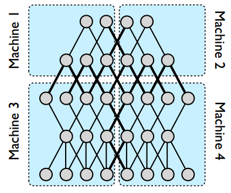
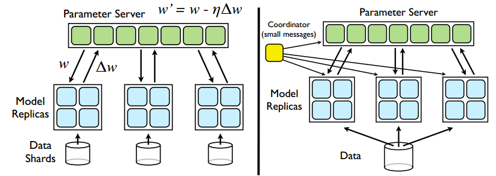
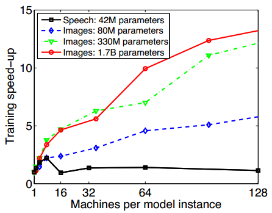
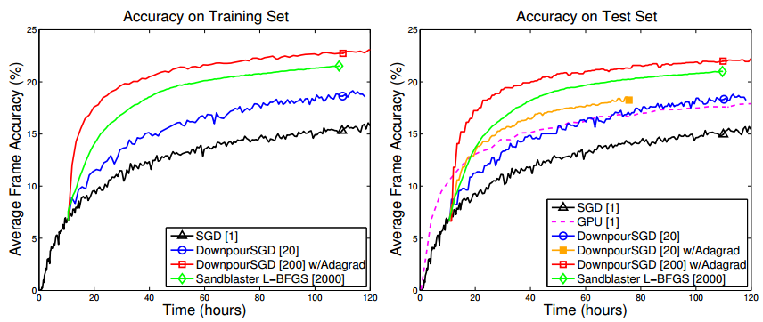
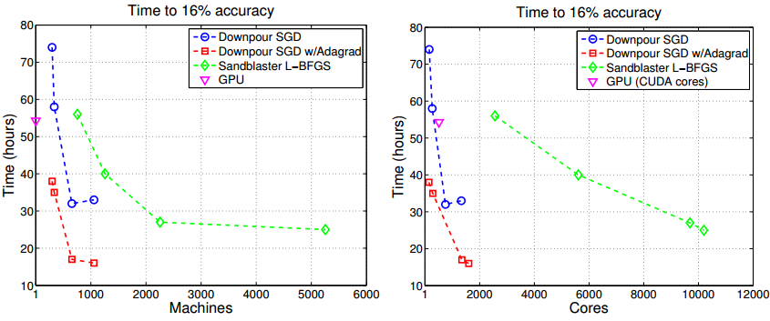

Adam：构建高效可扩展的深度学习训练系统_文献翻译

## 摘要

大型深层神经网络模型最近在硬视觉识别任务上展示了最先进的精确度。
不幸的是，这样的模型是非常耗时的训练和需要大量的计算周期。
我们描述了由商品服务器机器组成的分布式系统的设计和实现，以训练在视觉识别任务上展现世界级的性能、
规模和任务准确度的模型。
Adam通过整个系统协同设计实现高效率和可扩展性，优化和平衡工作负载计算和通信。
我们在整个系统中利用不同步来提高性能，并显示它还提高了训练模型的准确性。
与以前认为可能的相比，Adam的效率和可扩展性要高得多，而且在ImageNet 22,000类别的图像分类任务中，
使用30倍的机器来训练一个大的20亿的连接模型，在相同的时间内可以比以前的系统要高2倍精确度。
我们还表明，更大的模型可以提高任务的准确性。
我们的研究结果提供了令人信服的证据，使用现有训练算法的分布式系统驱动的深度学习方法值得追求。

## 1 引言

传统的统计机器学习与数据表和预测目标一起运行。
表中的行对应于独立的观察值，列与底层数据集的手工特征相对应。
然后，可以应用各种机器学习算法来学习将每个数据行映射到预测的模型。
更重要的是，训练好的模型也可以很好地预测从训练数据中得到的类似分布的未知的测试数据。
图1说明了这个过程。

这种方法适用于很多问题，比如推荐系统，其中人类领域的专家可以很容易地构建一组好的特征。
不幸的是，对于难以完成的人工智能任务，例如语音识别或视觉对象分类，要在输入数据上构建适当的特征非常困难。
深度学习试图通过从原始输入数据中额外学习分层特征，然后使用这些特征进行预测来解决这个缺点，如图2所示[1]。
在本文中，我们关注的是深度神经网络（DNN）。

深度学习最近在语音识别和视觉对象识别任务方面取得了成功，主要是因为训练这些模型的计算能力的进步[14,17,18]。
这是因为学习分层特征要比优化预测模型要困难得多，因此这个过程需要更多的训练数据和计算能力才能成功。
虽然在深度学习系统训练方面有了一些进展，但核心算法和模型在八十年代和九十年代几乎没有改变[2,9,11,19,25]。

复杂的任务需要具有大量参数的深层模型，这些参数必须经过训练。
这样的大型模型需要大量的数据用于成功的训练，以防止训练数据的过度拟合，这导致在未知的测试数据上泛化性能差。
图3说明了较大的DNN和更多的训练数据对视觉图像识别任务的准确性的影响。
不幸的是，如图4所示，增加模型大小和训练数据（这对于复杂任务的良好预测精度是必需的）
需要大量的计算周期与模型大小和训练数据量的乘积成比例。

由于深度学习的计算要求，几乎所有的深度模型都是在GPU上训练的[5,17,27]。
虽然这种模式适用于连接到单个服务器的2-4个GPU卡内，但它限制了可以训练的模型的大小。
为了解决这个问题，研究人员最近建立了一个由商品服务器组成的大规模分布式系统，用于训练超大型模型，
以达到世界纪录的精确度，以硬件视觉对象识别任务 - 仅使用原始像素信息将图像分类到22000个不同类别之一[7 ，18]。
不幸的是，他们的系统规模很小，并不是一个可行的经济有效的选择来训练大规模DNN [7]。

## 2 过去的工作

近年来，商业和学术机器学习数据集以前所未有的速度增长。
作为回应，许多作者已经探索了通过并行化和分布扩大机器学习算法[11，12，13，14，15，16，17]。
大部分研究都集中在线性凸模型上，其中分布式梯度计算是自然的第一步。
在这个领域内，一些小组已经放宽了同步的要求，探索了凸问题的延迟梯度更新[12,17]。
与此同时，其他研究稀疏梯度问题的团队（对于任何给定的训练样例，只有一小部分梯度向量坐标是非零的问题）
已经在共享存储器体系结构上探索了无锁非同步随机梯度下降即单机）[5,18]。
我们感兴趣的是一种捕捉两全其美的方法，允许使用一组机器异步计算梯度，但不要求问题是凸的或稀疏的。

在深度学习的背景下，大多数工作集中于在单个机器上培训相对较小的模型（例如，Theano [19]）。
扩大深度学习的建议包括使用一个GPU农场来训练许多小模型的集合，然后平均他们的预测[20]，
或修改标准的深度网络，使其本质上更可并行化[21]。
我们的重点是将深度学习技术扩展到训练非常大的模型（那些具有几十亿个参数的模型）的方向，但是不对模型的形式施加限制。
在一个层次支配计算的特殊情况下，一些作者考虑将计算分布在这一层中，并在其余层中进行复制[5]。
但是在一般情况下，模型的许多层是计算密集型的，需要思想上类似于[22]的全模型并行。
然而，要成功，我们相信模型并行性必须与利用数据并行性的巧妙分布式优化技术相结合。

我们考虑了一些现有的大规模计算工具来应用于我们的问题，MapReduce [23]和GraphLab [24]是值得注意的例子。
我们得出的结论是，针对并行数据处理而设计的MapReduce不适合深度网络训练中固有的迭代计算;
而为通用（非结构化）图计算而设计的GraphLab则不会利用通常在深度网络中发现的结构图中可用的计算效率。

——————
注：我们在 Sandblaster框架中实现了L-BFGS，但是其通用方式适合于其他许多优化方法。

## 3 模型并行

为了促进非常大的深度网络的训练，我们开发了一个软件框架DistBelief，它支持神经网络和分层图形模型中的分布式计算。
用户定义在模型的每一层中的每个节点处发生的计算，以及在计算的向上和向下(注)阶段期间应该传递的消息。
对于大型模型，用户可以将模型分割成多个机器（图 1），以便将不同节点的计算责任分配给不同的机器。
该框架使用所有可用内核在每台机器上自动并行计算，并在训练和推理期间管理机器之间的通信，同步和数据传输。

在多台机器上分发深层网络的性能优势取决于模型的连接结构和计算需求。
具有大量参数或高计算需求的模型通常受益于访问更多的CPU和内存，直到通信成本占主导地位。
我们已经在DistBelief框架中成功运行了144个分区的大型模型，显着提升了速度，
而更适度大小的模型显示了高达8或16个分区的体面加速。（见模型并行性基准标题第五部分的实验结果。）
显然，考虑到通信要求较低，具有局部连接结构的模型比全连接结构更倾向于广泛分布。
不理想的加速的典型原因是在不同机器上的处理时间差异，导致许多机器等待单个最慢的机器完成给定的计算阶段。
尽管如此，对于我们最大的模型，我们可以有效地使用32台机器，
其中每台机器的平均CPU利用率为16个内核，共512个CPU内核来培训单个大型神经网络。
结合下一节中介绍的分布式优化算法（利用整个神经网络的多个副本），
可以使用数万个CPU核心来训练单个模型，从而显着减少总体训练时间。
——————
注：向上和向下在神经网络的例子中又被称为前馈和反向传播，在隐马尔可夫模型中，可能“前向”和“后向”会更为熟悉。

图1：DistBelief中模型并行的例子。
只有边缘跨越分区边界（粗线）的节点才需要在机器之间传输其状态。
即使在一个节点有多个边界穿过分区边界的情况下，其状态也只会被发送到该边界另一边的机器。
在每个分区内，单个节点的计算将在所有可用的CPU内核之间并行化。

## 4 分布式优化算法

在DistBelief框架内并行化计算使得我们能够实例化和运行比以前报告的更大的神经网络。
但为了在合理的时间内训练这样的大型模型，我们不仅需要在模型的单个实例内并行化计算，还要在多个模型实例之间分配训练。
在本节中，我们将介绍这个第二级并行机制，在这里我们使用一组DistBelief模型实例或副本来同时解决单个优化问题。

我们介绍两种大规模分布式优化程序的比较：一种在线方法 Downpour SGD，一种批量方法的 Sandblaster L-BFGS。
这两种方法均利用集中分片参数服务器的概念，这些模型副本用于共享参数。
两种方法都利用分布式计算DistBelief允许在每个单独的副本中。
但是最重要的是，这两种方法的设计都是为了容忍不同模型副本的处理速度的变化，
甚至是模型副本的批量失败，这些模型副本可能会随机脱机或重启。

从某种意义上说，这两种优化算法实现了数据并行的智能版本。
两种方法都允许我们在许多模型副本中的每一个中同时处理不同的训练样本，并定期组合其结果以优化我们的目标函数。

### 4.1 Downpour SGD

随机梯度下降（SGD）可能是训练深度神经网络最常用的优化程序[25,26,3]。
不幸的是，SGD的传统表述本质上是连续的，使得将其应用于非常大的数据集是不切实际的，
其中以完全串行方式移动数据所需的时间是不可接受的。

为了将SGD应用于大数据集，我们引入了 Downpour SGD，
这是异步随机梯度下降的变体，它使用单个DistBelief模型的多个副本。
基本方法如下：我们将训练数据分成多个子集，并在这些子集上运行一个模型副本。
这些模型通过一个集中参数服务器来传递更新，这个参数服务器保持了模型的所有参数的当前状态，
在许多机器上分割（例如，如果我们有10个参数服务器分片，每个分片负责存储和应用更新到1/10 的模型参数）（图2）。
这种方法在两个截然不同的方面是异步的：模型副本彼此独立运行，参数服务器分片也相互独立运行。

在最简单的实现中，在处理每个小批量之前，模型副本会向参数服务器服务请求其模型参数的更新副本。
由于DistBelief模型本身在多台机器上进行分区，
因此每台机器只需要与保存与其分区相关的模型参数的参数服务器分片的子集进行通信。
在接收到其参数的更新副本之后，DistBelief模型副本处理一小批数据以计算参数梯度，
并将梯度发送给参数服务器，然后参数服务器将梯度应用于模型参数的当前值。

通过限制每个模型副本仅在每个 \\( n_{fetch} \\) 步骤请求更新的参数并且仅在每个 \\( n_{push} \\) 步骤
（其中 \\( n_{fetch}\\) 可能不等于 \\( n_{push} \\) ）时发送更新的梯度值，可以减少倾倒SGD的通信开销。
实际上，取三个参数，推梯度和处理训练数据的过程可以在三个只有弱同步的线程中进行（参见伪码附录）。
在下面报告的实验中，为了简单和易于与传统SGD进行比较，我们修正了 \\( n_{fetch} = n_{push} = 1 \\)。

与标准（同步）SGD相比， Downpour SGD对于机器故障更具有鲁棒性。
对于同步SGD，如果一台机器出现故障，整个训练过程就会延迟；
而对于异步SGD，如果模型副本中的一台机器出现故障，其他模型副本继续处理其训练数据并通过参数服务器更新模型参数。
另一方面，在 Downpour SGD中异步处理的多种形式在优化过程中引入了大量的附加随机性。
最明显的是，一个模型副本几乎肯定是基于一组稍微过时的参数来计算其梯度，
因为其他一些模型副本可能会同时更新参数服务器上的参数。
但是除此之外还有其他几个随机性的来源：因为参数服务器碎片独立运行，
所以不能保证在任何时候参数服务器的每个碎片上的参数经历了相同数量的更新，或者更新是以相同的顺序应用。
而且，由于允许模型副本在单独的线程中获取参数和推送梯度，所以参数的时间戳中可能会有其他细微的不一致。
这些操作对于非凸性问题的安全性没有什么理论基础，但实际上我们发现松弛一致性要求是非常有效的。

我们发现的一项技术可以大大提高 Downpour SGD的稳健性，就是使用Adagrad [10]自适应学习速率程序。
Adagrad并没有在参数服务器（图2中的η）上使用单一的固定学习速率，而是为每个参数使用单独的自适应学习速率。
\\(η_{i,K}\\)
为第K轮迭代中第i个参数的学习率，
\\( Δω_{i,k} \\)为梯度。
设：\\(η_{i,K} = γ/\sqrt{\sum_{j=1}^K{Δω_{i,k}^2}} \\)
因为这些学习速率只是从每个参数的平方梯度上计算出来的，所以Adagrad很容易在每个参数服务器分片中实现。
γ的值（所有学习率的常数比例因子）通常比没有Adagrad的最佳固定学习率更大（可能是一个数量级）。
Adagrad的使用扩展了可同时高效工作的模型副本的最大数量，并结合“热启动”模型训练的实践，
在释放其他副本之前仅使用单个模型副本，实际上消除了训练深度网络使用 Downpour SGD（见第5节结果）。

### 4.2 Sandblaster L-BFGS

已经证明批处理方法在训练小深度网络方面效果很好[7]。
为了将这些方法应用于大型模型和大型数据集，我们介绍了Sandblaster批处理优化框架，并讨论了此框架下L-BFGS的实现。

Sandblaster的一个重要思想是分布式参数存储和操作。
优化算法（如L-BFGS）的核心在于一个协调器进程（图2），该进程没有直接访问模型参数。
相反，协调器发出从一小组操作（例如点积，缩放，系数相加，乘法）中抽取的命令，
这些操作可以由每个参数服务器分片独立执行，结果本地存储在相同的碎片上。
附加信息，例如L-BFGS的历史缓存，也存储在计算它的参数服务器碎片上。
这允许运行大型模型（数十亿个参数），而不会将所有参数和梯度发送到单个中央服务器。
（请参阅伪码附录。）

在典型的L-BFGS并行实现中，数据分布到许多机器上，每台机器负责计算特定数据子集上的梯度。
梯度被发回到一个中央服务器（或通过一个树[16]聚合）。
许多这样的方法等待最慢的机器，因此不能很好地扩展到大的共享群集。
为了解决这个问题，我们使用下面的负载均衡方案：
协调器为N个模型副本中的每一个分配一小部分工作，远小于一个批处理总大小的1 / N，并且每当其空闲时进行分配。
采用这种方法，更快的模型副本比慢速副本做更多的工作。
为了在批处理结束时进一步管理缓慢的模型副本，协调器计划未完成部分的多个副本，并使用来自哪个模型副本首先完成的结果。
这种方案类似于在MapReduce框架中使用“备份任务”[23]。
通过将数据的连续部分分配给同一工作人员来预取数据以及支持数据亲和性，这使得数据访问成为一个非问题。
与需要与参数服务器进行频率较高，带宽参数同步的Downpour SGD相比，
Sandblaster只在每批开始时取得参数（当协调员更新时），并且只发送梯度完成的部分（防止副本故障和重新启动）。

图2:
左：Downpour SGD。模型副本以异步方式获取参数ω，传递Δω到参数服务器。
右：Sandblaster L-BFGS。一个“协调者”发送小消息到副本和参数服务器来编排批量优化。

## 5 实验

我们评估我们的优化算法，将它们应用于两种不同深度学习问题的训练模型：静止图像中的对象识别和语音识别的声学处理。

语音识别任务是将音频短片段中的中心区域（或帧）分类为几千个声学状态之一。
我们使用了一个五层的深层网络：四个带有S形启动的隐藏层，每层2560个节点，以及一个带有8192个节点的softmax输出层。
输入表示是11个连续重叠的25ms的语音帧，每个由40个对数能量值表示。
该网络是完全连接的层到层，共约4200万个模型参数。
我们训练了一组11亿个标记为弱的例子，并在一个保留测试集上进行评估。
见[27]类似的深层网络配置和培训程序。

对于视觉对象识别，我们在1600万图像的ImageNet数据集上训练了一个更大的具有局部连接感受域的神经网络，
每个图像我们缩放到100x100像素[28]。
网络有三个阶段，每个阶段由过滤，池化和局部对比归一化组成，其中过滤层中的每个节点连接到下面一层的10x10补丁。
我们的基础设施允许许多节点连接到相同的输入补丁，并且我们运行实验，改变从8到36相同连接节点的数量。
输出层包括21000个一对多逻辑分类器节点，每个节点一个 ImageNet对象类别。
见[29]类似的深层网络配置和训练程序。

#### 模型并行性基准：
为了研究DistBelief模型并行性的缩放行为（第3节），
我们测量了单个SGD模型实例中使用的分区（机器）数量的函数，以处理单个小批量的平均时间。
在图3中，我们通过报告平均训练速度来量化跨N台机器的并行化的影响：仅使用一台机器所花费的时间与使用N所花费的时间之比。
这些模型中的推理步骤的加速是类似的，这里没有显示。

中等大小的语音模型在8台机器上运行速度最快，比单台机器快2.2倍。（模型配置为每台机器使用不超过20个内核。）
在8台以上的机器上分配模型实际上减慢了培训速度，因为网络开销在完全连接的网络结构中开始占主导地位，
每台机器执行的工作量也较少。

相比之下，更大的局部连接的图像模型可以受益于每个模型副本使用更多的机器。
具有17亿参数的最大模型最有利，使用81台机器的加速超过12倍。
对于这些使用更多机器的大型机型，速度不断提高，但收益递减。

图3：
作为分配给单个DistBelief模型实例的机器的函数，针对四个不同深度网络的训练加速。
具有更多参数的模型比使用更少参数的模型更多地使用附加机器。

#### 优化方法比较
为了评估所提出的分布式优化程序，我们以各种配置运行上述的语音模型。
我们考虑两个基线优化程序：使用传统的（单一复制品）SGD训练DistBelief模型（在8个分区上），
并使用CUDA在GPU上训练相同的模型[27]。
我们与这些基准方法比较的三种分布式优化方法是：学习率固定下降的SGD，使用Adagrad学习率的Downpour SGD，
以及 Sandblaster L-BFGS。

图4显示了训练集和测试集上的每种方法的分类性能作为训练时间的函数。
我们的目标是在最少的培训时间内获得最大的测试集精度，无论资源需求如何。
传统的单复制SGD（黑色曲线）是最慢的训练。
用20个模型复制品（蓝色曲线）Downpour SGD表现出显着的改善。
用20个副本加上Adagrad（橙色曲线）的 Downpour SGD稍微快一点。
使用2000型复制品（绿色曲线）的 Sandblaster L-BFGS再次快得多。
然而，最快的是 Downpour SGD和Adagrad，有200个模型复制品（红色曲线）。
考虑到获得足够的CPU资源，Sandblaster L-BFGS和Downpour SGD与Adagrad都可以比高性能GPU更快地训练模型。

图4：
左：不同优化方法下的训练精度（在一个训练集的部分上）。
右：设置训练时间的分类精度。 Downpour 和 Sandblaster 使用与简单SGD相同的~10小时热启动。

虽然我们并没有将上述实验限制在一个固定的资源预算上，但是考虑各种方法如何权衡资源消耗来提高性能是很有趣的。
我们通过任意选择一个固定的测试集精度（16％）来分析这个问题，并且测量每个方法达到精确度所需的时间，
作为机器和CPU核心的函数，如图5。每条迹线上的四个点之一对应于训练配置如图4所示，其他三个点是替代配置。

在这个图中，越靠近原点的点是越好，因为它们占用更少的时间，同时使用更少的资源。
在这方面，使用Adagrad的 Downpour-SGD 似乎是最好的折衷：
对于机器或核心的任何固定预算，与Adagrad相比， Downpour SGD与达到精确度目标的时间相比，
具有固定学习率的Downpour SGD或Sandblaster L-BFGS。
对于任何分配的训练时间来达到准确的目标，与Adagrad的Downpour SGD使用的资源比Sandbalster L-BFGS少，
在许多情况下，具有固定学习率的 Downpour SGD 在规定期限内甚至不能达到目标。
Sandblaster L-BFGS系统在附加内核方面确实表现出了很大的优势，这意味着如果使用非常大的资源预算（如30k内核），
最终可能会产生最快的训练时间。

图5：对于不同优化策略达到固定精度所需要的时间（左为机器数目右为内核数）

#### 应用于ImageNet：
以前的实验表明，我们的技术可以加速数千万个参数的神经网络的训练。
然而，我们基于群集的分布式优化方法的更重要的优势在于它能够扩展到比单个机器更容易适应的模型，更不用说单个GPU。
作为探索超大型神经网络功能的第一步，我们使用了 Downpour SGD来训练ImageNet对象分类任务中上述的17亿参数图像模型。
如[29]中详述的，该网络实现了交叉验证的分类精度超过15％，相对于我们所知道的21k类别ImageNet分类任务的最佳性能，
相对提高了60％以上。

## 6 结论

本文介绍了深度网络并行分布式训练框架DistBelief。
在这个框架内，我们发现了几个有效的分布式优化策略。
我们发现，SGD的高度异步变体 - Downpour SGD对于训练非凸形深度学习模型非常有效。
Sandblaster L-BFGS是一种L-BFGS的分布式实施方式，可以与SGD竞争，并且更有效地利用网络带宽，
可以扩展到更大数量的并发内核来训练单个模型。
也就是说，Downpour SGD和Adagrad自适应学习速率程序相结合，在处理2000个CPU核心或更少的计算预算时，显然是明显的主导方法。

Adagrad最初不是用于异步SGD，并且这两种方法通常都不适用于非凸问题。
然而，令人惊讶的是，他们在一起工作得非常好，并且在高度非线性的深层网络上工作。
我们猜想Adagrad在面对异步更新的时候会自动稳定挥发性参数，并自然地调整学习速率以适应深层网络中不同层次的需求。

我们的实验表明，我们的新的大规模训练方法可以使用一组机器来训练即使是中等规模的深度网络，
也比GPU快得多，并且没有GPU对于模型的最大尺寸的限制。
为了展示能够训练更大模型的价值，我们已经训练了一个具有超过10亿个参数的模型，以实现比ImageNet目标识别挑战更好的性能。

$$x=\frac{-b\pm\sqrt{b^2-4ac}}{2a}$$
\\(x=\frac{-b\pm\sqrt{b^2-4ac}}{2a}\\)