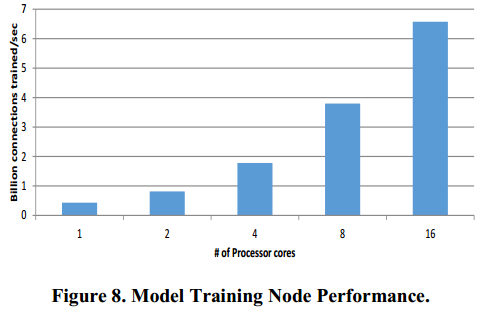

Adam：构建高效可扩展的深度学习训练系统_文献翻译

## 摘要

大型深层神经网络模型最近在硬视觉识别任务上展示了最先进的精确度。
不幸的是，这样的模型是非常耗时的训练和需要大量的计算周期。
我们描述了由商品服务器机器组成的分布式系统的设计和实现，以训练在视觉识别任务上展现世界级的性能、
规模和任务准确度的模型。
Adam通过整个系统协同设计实现高效率和可扩展性，优化和平衡工作负载计算和通信。
我们在整个系统中利用不同步来提高性能，并显示它还提高了训练模型的准确性。
与以前认为可能的相比，Adam的效率和可扩展性要高得多，而且在ImageNet 22,000类别的图像分类任务中，
使用30倍的机器来训练一个大的20亿的连接模型，在相同的时间内可以比以前的系统要高2倍精确度。
我们还表明，更大的模型可以提高任务的准确性。
我们的研究结果提供了令人信服的证据，使用现有训练算法的分布式系统驱动的深度学习方法值得追求。

## 1 引言

传统的统计机器学习与数据表和预测目标一起运行。
表中的行对应于独立的观察值，列与底层数据集的手工特征相对应。
然后，可以应用各种机器学习算法来学习将每个数据行映射到预测的模型。
更重要的是，训练好的模型也可以很好地预测从训练数据中得到的类似分布的未知的测试数据。
图1说明了这个过程。

这种方法适用于很多问题，比如推荐系统，其中人类领域的专家可以很容易地构建一组好的特征。
不幸的是，对于难以完成的人工智能任务，例如语音识别或视觉对象分类，要在输入数据上构建适当的特征非常困难。
深度学习试图通过从原始输入数据中额外学习分层特征，然后使用这些特征进行预测来解决这个缺点，如图2所示[1]。
在本文中，我们关注的是深度神经网络（DNN）。

深度学习最近在语音识别和视觉对象识别任务方面取得了成功，主要是因为训练这些模型的计算能力的进步[14,17,18]。
这是因为学习分层特征要比优化预测模型要困难得多，因此这个过程需要更多的训练数据和计算能力才能成功。
虽然在深度学习系统训练方面有了一些进展，但核心算法和模型在八十年代和九十年代几乎没有改变[2,9,11,19,25]。

复杂的任务需要具有大量参数的深层模型，这些参数必须经过训练。
这样的大型模型需要大量的数据用于成功的训练，以防止训练数据的过度拟合，这导致在未知的测试数据上泛化性能差。
图3说明了较大的DNN和更多的训练数据对视觉图像识别任务的准确性的影响。
不幸的是，如图4所示，增加模型大小和训练数据（这对于复杂任务的良好预测精度是必需的）
需要大量的计算周期与模型大小和训练数据量的乘积成比例。

由于深度学习的计算要求，几乎所有的深度模型都是在GPU上训练的[5,17,27]。
虽然这种模式适用于连接到单个服务器的2-4个GPU卡内，但它限制了可以训练的模型的大小。
为了解决这个问题，研究人员最近建立了一个由商品服务器组成的大规模分布式系统，用于训练超大型模型，
以达到世界纪录的精确度，以硬件视觉对象识别任务 - 仅使用原始像素信息将图像分类到22000个不同类别之一[7 ，18]。
不幸的是，他们的系统规模很小，并不是一个可行的经济有效的选择来训练大规模DNN [7]。

本文描述了一个由商品服务器组成的称为Adam的可扩展分布式深度学习训练系统，通过其设计和实现能够解决这个问题。
主要贡献包括：
- 通过整个系统的协同设计优化和平衡这个应用程序的计算和通信。
我们在机器上分割大型模型，以最大限度地减少内存带宽和交叉机器通信需求。
我们通过机器重构计算以减少通信需求。

- 通过利用机器学习训练能够很好地容忍不一致，实现高性能和可扩展性。
我们使用多种技术，包括无锁的多线程模型参数更新，利用权重更新的异步批量参数更新，
这些更新是关联和交换的，并允许对过时的参数值进行计算。
令人惊讶的是，异步训练似乎也提高了模型的准确性。

- 证明系统效率，规模和异步性都有助于提高训练模型的准确性。
在ImageNet 22,000类别图像分类任务中，Adam使用的机器数量减少了30倍，
可以在相当的时间内训练一个大型的20亿连接模型，其精度比以前为此基准测试记录的系统提高了2倍。
我们还表明，随着模型大小的提高，任务的准确性提高，而且Adam的效率可以用相同数量的资源来训练更大的模型。

我们的研究结果为分布式系统驱动的大规模深度学习提供了一个机会，通过使用高效和可扩展的计算集群，
而不是仅仅依靠机器学习算法突破，对海量数据进行更大模型的训练来提高预测的准确性。

本文的其余部分安排如下。
第2节介绍了关于视觉任务训练深度神经网络的背景材料，并提供了大规模分布式训练的简要概述。
第3节介绍了Adam的设计和实现，重点是计算和通信优化，以及异步使用，这些都提高了系统效率和缩放比例。
第4节评估亚当的效率和可扩展性以及它训练的模型的准确性。
最后，第5部分涵盖相关工作。

## 2 背景

### 2.1 视觉上的深度神经网络

人工神经网络由大量的具有多个输入和一个输出的称为神经元的同类计算单元组成。
如图2所示，它们通常以分层的方式连接到层1中的神经元的输出，连接到层1中的所有神经元。
深层神经网络具有允许分层特征学习的多个层。

神经元i在l层的输出，称为激活，由如下函数计算：

其中是与神经元i和j之间的连接相关的权重，
是与神经元i相关的偏差项。权重和偏差项构成了必须学习完成指定任务的网络的参数。
与网络中的所有神经元相关联的激活函数F是预定义的非线性函数，通常是S形或双曲正切。

卷积神经网络是一类由视觉皮层早期工作而受到生物启发的神经网络[15,19]。
一层中的神经元只连接到下一层的空间局部神经元，建立局部视觉接受场。
另外，这些连接共享权重，允许特征检测而不管视野中的位置。
权重分配还减少了必须学习的自由参数的数量，因此与类似大小的网络相比，
这些模型更容易训练，其中层中的神经元完全连接到下一层中的所有神经元。
卷积层之后通常是最大汇聚层，其通过从不重叠的子区域输出最大值来执行非线性下采样。
这为网络的小型转换提供了输入的的鲁棒性，因为最大共享层将产生相同的值。

执行多类分类的神经网络的最后一层通常实现softmax函数。
该函数将任意实数值的n维向量转换为0和1之间范围内的值的n维向量，使得这些分量值总和为1。

我们专注于视觉任务，因为这些可能需要最大规模的神经网络，大约三分之一的人类皮层专注于视觉。
最近的研究表明，由5个卷积层组成的深度神经网络，用于学习视觉特征，然后是3个完全连接的层，
用于组合这些学习的特征以作出分类决策，从而实现视觉对象识别任务的最新性能[17，27]

### 2.2 神经网络训练

神经网络通常通过使用梯度下降的反向传播来训练。
随机梯度下降是一种经常用于可扩展训练的变体，因为它需要较少的跨机器通信[2]。
在随机梯度下降中，训练输入以随机顺序处理。
一次处理一个输入，对每个输入执行以下步骤以更新模型权重。

前馈步骤：

每个神经元i在一个层l中的输出，称为其激励a，作为来自前一层l-1（或第一层的输入数据）中的神经元的k个输入的函数。 
如果是与层l-1中的神经元j和层l中的神经元i之间的连接相关联的权重：

其中b是神经元的偏置项。

反向传播：

误差项：对每个神经元i均进行计算，在输出层  ，第一次误差如下：

其中t(x)是输出的实际值，F'(x)是F(x)的导函数。

这些误差按如下方式反向传播，从l+1层到l层：

权值更新：

这些误差项用于更新权值（包括偏置）：

for j=1..k

其中α是学习率参数，对于每个输入重复该过程，直到整个训练数据集已经被处理，这构成了训练时期。
在训练时期结束时，模型预测误差在保持的验证集上计算。
通常，对于多个时期继续训练，每次都重新处理训练数据集，直到验证集错误收敛到期望的（低）值。
然后对（未看到的）测试数据评估训练后的模型。

### 2.3 分布式深度学习训练

最近，Dean等人描述了一个由数万个CPU内核组成的大规模分布式系统，用于训练大型深度神经网络[7]。
他们使用的系统架构（如图5所示）基于Multi-Spert系统，同时利用模型和数据的并行性[9]。
大型模型跨多个模型工作器机器分区，使模型计算可以并行进行。
大型模型需要大量的训练数据，因此系统允许同一模型的多个副本在训练数据集的不同分区上并行训练。
所有模型副本都共享一组存储在全局参数服务器上的通用参数。
为了操作的速度，每个模型副本并行操作，并异步发布模型权重更新，并从参数服务器接收更新的参数权重。
虽然这些异步更新导致了共享模型参数的不一致性，但是神经网络是一个灵活的学习体系结构，
并且他们展示了大型模型的成功训练，以便在视觉对象识别任务上获得世界级的准确性[18]。

## 3 ADAM系统架构

我们的高级系统体系结构也是基于Multi-Spert系统，由数据服务机构组成，
这些机器提供组织成多个副本的训练输入，用以训练机器，通过全局参数服务器异步更新共享模型。
在描述Adam的设计和实现的同时，我们将重点放在提高系统效率和扩展性的计算和通信优化上。
这些优化是由我们过去建立大规模分布式系统的经验以及通过分析和迭代改进Adam系统所激发的。
另外，该系统从底层开始支持异步训练。

虽然我们在本文中关注视觉任务，但Adam系统是通用的，
因为随机梯度下降是一种通用的训练算法，可以通过反向传播训练任何DNN。
此外，Adam还支持对堆叠卷积网络和完全连接的网络层进行任意组合训练，
并且可以用于训练诸如语音识别和文本处理等任务的模型。

### 3.1 快速数据服务

训练大型DNN需要大量的训练数据（10-100 TB）。
即使有大量的训练数据，这些DNN也需要进行数据转换，以避免在多次迭代数据集时过拟合。
我们将一小部分机器配置为数据服务机器，以减轻模型训练机器对这些转换的计算需求，并确保高吞吐量的数据传输。

对于视觉任务，转换包括图像转换，反射和旋转。
通过对每个图像随机应用不同的变换来增强训练数据集，使得每个训练时期有效地处理相同图像的不同变体。
这是事先完成的，因为一些图像变换是计算密集型的，并且我们希望在请求时立即将变换的图像流传送到模型训练机器。

数据服务器预先将利用几乎整个系统存储器的图像缓存为图像缓存以加速图像服务。
他们使用异步IO来处理传入的请求。
模型训练机器使用后台线程预先分批地请求图像，使得主训练线程始终具有存储器中所需的图像数据。

### 3.2 模型训练

视觉任务的模型通常包含一些卷积层，然后是几个完全连接的层[17,27]。
如图6所示，我们将模型垂直分布在模型工作器上，因为这样可以最大限度地减少卷积层所需的跨机器通信量。

#### 3.2.1 多线程训练

机器上的模型训练是多线程的，不同的图像分配给共享模型权重的线程。
每个线程为前馈评估和反向传播分配一个训练上下文。
此训练上下文存储每个图层的反向传播期间计算的激活和权重更新值。预先分配上下文以避免训练时堆锁。
中间结果的上下文和每线程暂存缓冲区都使用NUMAaware分配来减少跨内存总线流量，因为这些结构经常被访问。

#### 3.2.2 快速权值更新

为了进一步加速训练，我们在本地访问和更新共享模型权重，而不使用锁。
每个线程计算重量更新并更新共享模型权重。
这引入了一些竞争，以及潜在的修改权重的基础上陈旧的权重值，用来计算权重更新，但已被其他线程更改。
尽管如此，我们仍然能够训练模型来进行收敛，因为权重更新是关联和交换的，
并且因为神经网络是有弹性的并且可以克服这个引入的少量噪声。
不锁定更新权重与Hogwild系统类似，除了我们依赖于权重更新是关联和交换，而不是要求模型稀疏以最小化冲突[23]。
在单台机器上使用多个线程时，这种优化对于实现良好的扩展性非常重要。

#### 3.2.3 减少存储拷贝

在模型训练期间，数据值需要在神经元层之间传递。由于该模型是跨多个机器进行分区的，所以这种通信的一些不是本地的。
我们使用统一的优化界面来加速这种沟通。
不再是复制数据值，我们传递一个指向相关神经元块的指针，其输出需要通信，避免了昂贵的存储器拷贝。
对于非本地通信，我们使用IO完成端口在Windows套接字API的基础上构建了自己的网络库。
这个库与我们的数据传输机制兼容，并且接受一个指向需要通过网络传输输出值的神经元块的指针。
我们利用跨机器静态模型划分的知识来优化通信，并使用引用计数来确保异步网络IO存在时的安全性。
这些优化降低了模型培训的内存带宽和CPU需求，对于在模型跨机器分区时实现良好性能非常重要。

#### 3.2.4 存储系统优化

我们在多台机器上分割模型，使得模型层的工作集适合三级缓存。
三级缓存比主内存具有更高的带宽，并且使我们能够最大限度地利用机器上的浮点单元，否则将会受到内存带宽的限制。

我们还优化了我们对缓存局部性的计算。
前向评估和后向传播计算在优选层重矩阵的行主要或列主要布局方面具有相互竞争的局部性要求。
为了解决这个问题，我们创建了两个自定义的手动调整的程序集内核，它们适当地打包和阻塞数据，
使得矢量单元被完全用于矩阵乘法运算。 这些优化可以最大限度地利用机器上的浮点单元。

#### 3.2.5 缓解机器速度慢的影响

在任何大型计算集群中，即使所有计算机共享相同的硬件配置，机器之间的速度也总是会有差异。
虽然我们已经将模型训练设计为大多数是异步的以减轻这个影响，但是这个速度差异有两个地方有影响。
首先，由于模型是跨多个机器分区的，因此处理图像的速度受到慢速机器的限制。
为了避免速度较慢的机器上挂起线程，这些机器等待数据值从较慢的机器到达，我们允许线程并行处理多个图像。
我们使用数据流框架来根据远程机器的数据到达来触发单个图像的进度。
速度差异显现的第二个地方是在一个时期的末尾。
这是因为我们需要等待所有训练图像进行处理，以计算验证数据集上的模型预测误差，并确定是否需要额外的训练时期。
为了解决这个问题，我们实现了一个简单的解决方案，只要指定部分的图像被完全处理，就结束该时期。
我们通过随机化每个周期的图像处理顺序来确保同一组图像不会被跳过每个时期。
我们已经凭经验确定，等待75％的模型副本完成处理所有的图像，然后宣布完成训练时期可以加快训练速度高达20％，
而不影响训练模型的预测精度。我们没有实现的替代解决方案是让速度较快的机器从较慢的机器上偷取工作。
但是，由于我们目前的方法不会影响模型的准确性，所以这个方法不可能超越它。

#### 3.2.6 参数服务器通信

我们实现了两种不同的通信协议来更新参数权重。
第一个本地计算和累加缓冲区中的权重更新，当k（通常是数百）个图像已经被处理时，缓冲区定期发送给参数服务器机器。
参数服务器机器然后直接将这些累积的更新应用于存储的权重。
这对于卷积层很有效，因为由于重量分配，权重的体积很小。
对于具有更多权重的全连接层，我们使用不同的协议来最小化模型训练和参数服务器机器之间的通信流量。
我们不直接发送权重更新，而是将激活和误差梯度向量发送到参数服务器机器，
在这些机器上矩阵乘法可以在本地执行，以计算和应用权重更新。
这使得通信流量从M * N大大降低到k *（M + N），极大地提高了系统的可扩展性。
此外，它还有一个额外的好处，
因为它可以将CPU大量使用的模型训练机器的计算负担转移到CPU未充分利用的参数服务器机器上，从而实现更好的平衡系统。

### 3.3 全局参数服务器

参数服务器与接收模型参数更新的模型训练机持续通信并发送当前的权重值。
将参数服务器建模为传统分布式键值存储会导致更新速率过高。
参数服务器节点的体系结构如图7所示。

#### 3.3.1 吞吐量优化

模型参数分为1 MB大小的分片，它表示参数空间的连续分区，并且这些分片被散列到在参数服务器机器之间平均分配的存储桶中。
这种分区改进了更新处理的空间局部性，而分布有助于负载平衡。
此外，我们伺机批量更新。
这改善了时间局部性，并且在移动到分片中的下一个块之前通过将所有更新批次应用于参数块来缓解对L3缓存的压力。
参数服务器使用SSE / AVX指令来应用更新，所有处理都是NUMA知道的。
在特定的NUMA节点上分配碎片，并通过设置合适的处理器掩码，将任务分配给绑定到NUMA节点的处理器的线程，
从而将碎片的所有更新处理本地化到该NUMA节点。
我们在高流量执行路径中使用无锁数据结构来处理队列和哈希表，以加速网络，更新和磁盘IO处理。
此外，我们实现了无锁内存分配，其中缓冲区从指定大小的池中分配，这些池的功率从4KB一直到32MB。
对象的全局锁定空闲池满足小对象分配。
所有这些优化对于实现良好的系统可扩展性至关重要，并且通过迭代系统优化得以消除规模瓶颈。

#### 3.3.2 延迟持久性

我们从更新处理路径中分离出耐用性，以便为训练节点提供高吞吐量。
参数存储被建模为写回缓存，在后台异步刷新脏块。
潜在的数据丢失窗口是存储层支持的IO吞吐量的函数。
由于DNN模型即使在少量丢失更新的情况下也能够学习，所以这是可承受的，因为基础系统具有弹性。
此外，如果需要，可以通过对适当的输入数据重新训练模型来有效恢复这些更新。
这种延迟的持久性允许将压缩写入持久存储，因为许多更新可以被折叠成单个参数更新，
这是由于更新的附加性质，在几轮刷新之间。这允许更新周期赶上参数碎片的当前状态，尽管更新周期较慢。

#### 3.3.3 容错操作

系统中每个参数分片有三个副本，并存储在不同的参数服务器上。
被指定为主服务器的碎片版本主动服务，而另外两个副本被指定为次要服务器以实现容错功能。
参数服务器由一组形成Paxos群集的参数服务器（PS）控制器机器控制。
控制器维护其复制状态的参数服务器集群的配置，其中包含碎片和角色到参数服务器的映射。
客户（模型训练机器）联系控制器来确定参数碎片的请求路由。
PS控制器将存储桶分配（通过租赁的主要角色，具有主要租赁信息的辅助角色）分发给参数服务器，
并将租赁信息保持其复制状态。
控制器还接收来自参数服务器机器的心跳，并将故障机器的存储桶均匀地重新分配给其他活动机器。
这包括为发生故障的机器作为主要的存储桶分配新的租赁。

作为存储区主要参数的服务器计算机接受该存储区中所有区块的参数更新请求。
主机通过2阶段提交协议将对桶内的分片的更改复制到所有辅助机器。
在提交之前，每个辅助节点检查存储桶的租约信息，以查找由主机初始化的复制请求。
每个参数服务器机器都会为所有存储桶将心跳发送到适当的辅助机器，以便将其设定为主机。
当存在长时间没有来自当前主机心跳的心脏跳动时，
对于存储桶次要的参数服务器启动角色更改提议作为主要连同先前的主要租赁信息给控制器。
控制器将选择其中一台辅助机器作为新的主机，为该存储桶分配一个新的租约，
并将该信息传播到该存储桶所涉及的所有参数服务器节点。
在参数服务器节点中，存储桶的磁盘存储被建模为日志结构化块存储，以便为写入繁重的工作负载优化磁盘带宽。

过去两年我们广泛使用Adam进行了几次训练实验。
在这些运行过程中，机器确实失败，并且所有这些容错机制都在某个时刻被执行。

#### 3.3.4 通信隔离

参数服务器机器有两个10Gb网卡。 由于从客户端（训练）角度来看参数更新处理与持久性是分离的，
所以2条路径被隔离到它们自己的NIC中，以最大化网络带宽并最小化干扰，如图7所示。
另外，我们将从控制器1Gb网卡管理流量。

## 4 评估

### 4.1 视觉对象识别任务

我们评估亚当使用两个流行的基准图像识别任务。
MNIST是一个数字分类任务，输入数据由10个手写数字的28x28图像组成[20]。
这是一个非常小的基准，具有6万个训练图像和10,000个测试图像，我们用它来表征训练模型的基准系统性能和准确性。
ImageNet是一个庞大的数据集，其中包含超过1500万标记的高分辨率图像，属于大约22000个不同的类别[8]。
这些图像是从网上的各种来源收集的，并使用Mechanical Turk进行标记。
ImageNet包含可变分辨率的图像，但与其他图像一样，我们将所有图像下采样到固定的256x256分辨率，
并将一半数据集用于训练，另一半用于测试。
这是最大的公开可用的图像分类基准，并且在22,000个类别中正确地分类图像的任务是非常困难的（例如区分美国和英国的狐狸）。
这个任务的表现是根据top-1准确性来衡量的，这个准确性将模型的最佳选择与图片标签进行比较，
并为正确的答案分配1分，不正确的答案为0。没有部分准确。随机猜测将导致只有大约0.0045％的前1精度。
根据我们在这个基准测试中的经验，人类的表现不太可能超过20％的准确率，
因为这个任务需要正确区分数百种狗，蝴蝶，花朵等。我们用这个基准来表征Adam的表现、规模、训练模型的准确性。

### 4.2 系统硬件

Adam目前由120台相同的机器组成，这些机器由三台IBM G8264交换机连接的同等大小的机架组成。
每台计算机都是带有双Intel Xeon E5-2450L处理器的HP Proliant服务器，共有16个内核，运行速度为1.8Ghz，主内存为98GB，
两个10Gb网卡和一个1Gb网卡。所有机器都有四个7200转硬盘。
一个1TB的驱动器托管操作系统（Windows 2012服务器），另外三个硬盘驱动器每个都是3TB，并配置为RAID阵列。
根据实验，这套机器可以稍微有点不同，但是从90台机器中选择模型训练机器，从20台机器池中选择参数服务器，
从10台机器池中选择图像服务器。这些池包括机器故障时的容错机器。

### 4.3 基线性能和准确性

我们首先通过关注单个模型训练和参数服务器机器来评估Adam的基准性能。
另外，我们通过在MNIST数字分类任务上训练一个小模型来评估基线训练的准确性。

#### 4.3.1 模型训练系统

我们训练一个包含大约250万个连接（稍后介绍）的小型MNIST模型，
以在没有参数服务器的单个模型训练机器上进行收敛，并改变用于训练的处理器核心的数量。
我们测量的平均训练速度是以每秒训练的数十亿个连接（模型连接*训练样例*时期数）/（挂钟时间）计算的，
并将其与训练用的处理器核数进行比较。
结果如图8所示。由于我们允许参数在不锁定的情况下更新参数，所以Adam显示了出色的缩放比例，因为我们增加了核心数量。
由于缓存效应和后续线性，缩放是超线性的，最多4个核心。

#### 4.3.2 参数服务器

为了评估单个参数服务器的多核缩放，我们收集了来自ImageNet 22K模型训练运行的参数更新流量，
因为MNIST参数更新太小而不足以强调系统并运行一系列模拟测试。
对于所有的测试，我们比较机器能够维持的参数更新率，因为我们增加了可用于处理的服务器核心数量。
回想一下，我们支持两个更新API——一个参数服务器直接接收权重更新，
另一个接收它必须乘以计算权重更新的激活和误差梯度向量。
结果如图9所示。当通过网络发送权重更新时，网络带宽是限制因素，导致性能不佳和缩放。
假设一个快速的网络，我们看到扩展到8个内核之后，我们达到了内存带宽的瓶颈。
当本地计算权重更新时，我们看到了良好的扩展性，因为我们已经平铺了计算以有效地使用处理器缓存，避免了内存带宽瓶颈。
虽然我们目前的网络技术限制了我们的更新吞吐量，但我们仍然能够维持每秒超过13亿次更新的非常高的更新速率。

#### 4.3.3 训练模型精确度

MNIST基准主要以两种形式进行评估。
一个变体通过仿射变换或弹性变形来变换训练数据，以将有限的训练数据有效地扩展到更大的集合，
从而导致经训练的模型泛化良好，并且在不可见的测试数据上实现更高的准确性[5,26]。
传统的形式不允许数据转换，所以所有的培训只能使用有限的6万个培训例子。
由于我们的目标是评估Adam在基于少量数据训练的小模型上的基准性能，我们使用了MNIST数据而没有任何转换。

我们为这个基准训练了一个相当标准的模型，其中包括2个卷积层，
其次是两个完全连接的层和一个最终的10个softmax输出层[26]。
卷积层使用5x5内核，每个内核之后是2x2最大池层。
第一个卷积层有10个特征图，第二个卷积层有20个。完全连接的层使用400个隐藏单元。
由此产生的模型很小，有大约250万个连接。预测精度结果如表1所示。
我们的目标是以Goodfellow等人的基准测试的最新准确度为目标进行竞争。
使用我们尚未实现的复杂的训练技术[12]。令我们吃惊的是，我们超出了他们的准确率0.08％。
从这个角度来看，这个改进需要四年时间的深入学习，才能把这个任务的准确性提高0.08个百分点。
我们相信，我们的准确性提高来自于Adam的异步性，它增加了一种随机噪声的形式，
而训练有助于模型在看不见的数据时更好地概括。
另外，异步可能有助于模型从不稳定的局部最小值中逃脱，从而找到更好的局部最小值。
为了验证这个假设，我们只使用一个线程在MNIST数据上训练相同的模型，以确保同步训练。
我们把这个模型训练到收敛，这个过程要花费很长时间我们最好的同步变量的结果如表1所示，表
明异步有助于提高模型精度0.24％，这是一项显着的增加。
这一结果与该领域的传统既定智慧相矛盾——传统认为异步降低了模型预测的准确性，并且必须尽可能地控制。

### 4.4 系统规模和准确度

我们在多个维度评估系统性能和可扩展性，并评估其为ImageNet 22K分类任务培训大型DNN的能力。

#### 4.4.1 模型工作单元规模

我们评估Adam通过在多台机器上进行分区来训练非常大的模型的能力。
我们使用ImageNet基准测试的单个训练时期来确定我们可以在给定的多机器配置上有效训练的最大尺寸模型。
我们通过增加卷积图层中的特征图的数量来增加模型大小，并且训练模型为一个周期，直到我们观察到训练速度的降低。
对于这个测试，我们只使用一个没有参数服务器的模型副本。
结果如图10所示，表明Adam能够使用相对较少的机器来训练极大的模型。
我们的16机器配置能够训练36 Bn连接模型。
更重要的是，当我们将模型分配到更多的机器上时，我们可以有效训练的模型的大小超线性地增加。
我们的测量结果表明，这是由于随着机器数量的增加，大部分模型层的工作集适合L3缓存的缓存效应。
虽然ImageNet数据集没有足够的训练数据来训练这样的大型模型来收敛，
但这些结果表明Adam能够训练具有良好放大规模性质的模型。

#### 4.4.2 模型副本规模

我们评估向Adam添加更多模型副本的影响。
每个副本包含4台机器，并在这些机器上分区有ImageNet模型（稍后介绍）。
结果显示在图11中，其中我们评估了包含4,10,12,16和22个复制品的配置。
所有实验都使用了由20台机器组成的相同参数服务器配置。结果表明Adam与另外的复制品很好比例。
请注意，没有参数服务器的配置只是作为比较的参考，因为如果没有共享参数服务器，模型不能共同学习。
虽然参数服务器确实增加了一些开销，但系统仍然具有良好的扩展性。

#### 4.4.3 训练模型精度

我们为ImageNet 22K类别对象分类任务训练了一个大而深的卷积网络，其结构与之前的工作[17,27]相似。
该网络具有五个卷积层，随后是三个完全连接的层，具有最终的22,000路softmax。
卷积核的大小从3×3到7×7，卷积特征映射的大小在120到600之间。
第一，第二和第五卷积层之后是3×3最大池层。完全连接的层包含3000个隐藏单元。
由此产生的模型是相当大的，包含超过2Bn连接。
虽然Adam能够训练更大的模型，但ImageNet训练数据量是这些实验的限制因素。

我们使用4台图像服务器，配置了16台模型复制机（每台复制机包含4台机器）和10台参数服务器（共62台机器），
对这个模型进行了10天的融合训练。结果如表2所示。
在一周内对2000台机器上的1Bn连接模型进行培训（我们的模型在使用62台机器的一天培训中超过了13.6％的准确度），
获得了13.6％的基准。 当他们补充了ImageNet训练数据和1,000万个未标记图像，
他们使用1000台机器进行了3天的Youtube视频采样，他们能够将预测精度提高到15.8％。
我们的模型能够使用ImageNet训练数据达到29.8％的新的世界纪录预测准确度，这比以前最好的是2倍的进步。

为了更好地理解这个准确度提高的原因，我们使用Adam来训练一些较小的模型来完成这个任务。
结果如图12所示，表明训练较大的模型提高了任务的准确性。
这突出了Adam的效率和可扩展性的重要性，因为它能够培训更大的模型。
此外，与以前的工作相比，我们的1.1 Bn连接模型在此任务上的准确度达到了24％，而相似尺寸模型的精度达到了13.6％。
虽然由于同步执行速度太慢，我们无法隔离异步对此任务的影响，
但这一结果与MNIST准确度数据一起提供了异步有助于提高准确度的证据。
该图还似乎表明随着模型大小的增加，准确度的提高减慢，但我们注意到，
较大的模型正在用相同数量的数据进行训练。复杂任务的较大模型可能需要更多的训练数据才能有效地利用其能力。

 

#### 4.4.4 讨论

Adam通过允许线程在不锁定的情况下更新本地参数权重，在单台机器上实现了高度的多线程可伸缩性。
它通过在参数服务器机器上执行权重更新计算并对参数值执行异步批量更新来实现良好的多机器可扩展性，
所述参数值利用这些更新关联和交换。
最后，Adam通过利用其效率来训练非常大的模型并利用不同步来进一步提高准确性，从而使训练模型达到高精度。

## 5 相关工作

由于深度学习的计算需求，深度模型通常在GPU上训练[5,14,17,24,27]。
虽然这种模式适用于连接到单个服务器的2-4个GPU卡内，但它限制了可以训练的模型的大小。
因此，在这些系统上训练的模型通常在更小的ImageNet 1,000类别分类任务上进行评估[17,27]。

最近的工作尝试使用由Infiniband连接的16个GPU服务器的分布式集群，
在图像分类任务上训练跨服务器分割的大型DNN [6]。训练大型模型到高精度通常需要迭代大量的数据。
除非系统支持数据并行性，否则这在合理的时间内是不可行的。
不幸的是，GPU计算和网络互连之间的速度不匹配使得通过参数服务器支持数据并行性变得非常困难。
在等待模型参数更新时，GPU必须经常停顿，否则由于同步不足，模型可能会发散。
这项工作不支持数据并行性，而且训练的大型模型比小型模型的准确性要低。

DistBelief系统[7]是我们唯一可以比较的系统，用于训练支持模型和数据并行性的大规模DNN。
该系统已经被用于在ImageNet 22K分类任务上训练大DNN（10亿个连接）到高精度，但是每周使用2000台机器的计算成本很高。
此外，该系统的扩展效率差，不是一个可行的成本效益的解决方案。

GraphLab [21]和类似的大规模图形处理框架被设计为在一般的非结构化图上运行，
并且不可能提供有竞争力的性能和可扩展性，因为它们不利用深度网络结构和训练效率。

视觉和计算机体系结构社区已经开始探索视觉神经网络模型的硬件加速[3,4,10,16,22]。 
目前，这项工作集中在对已经训练的网络进行有效的前馈评估，并且重点补充了我们训练大型DNN的工作。

## 6 结论

我们表明，大规模的商品分布式系统可以用来有效地训练非常大的DNNs到硬视觉任务的世界记录的准确性，
使用当前的训练算法，通过使用Adam来训练一个大的DNN模型，在ImageNet上实现世界记录的分类性能22K类任务。
虽然我们已经使用120台机器集群来实施和评估Adam，但是缩放结果表明更大的系统可能被更有效地用于训练大型DNN。

