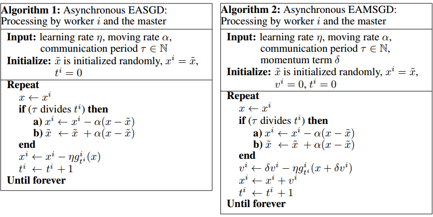
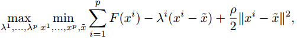
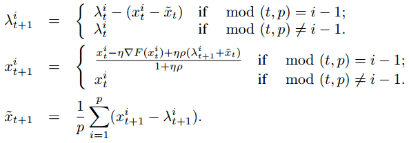
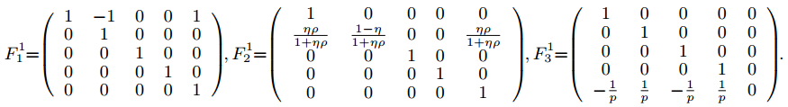
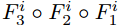
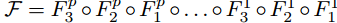
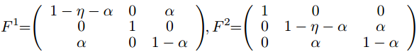
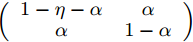

弹性均衡SGD的深度学习_文献翻译

## 摘要

在通信约束条件下，研究并行计算环境下深度学习的随机优化问题。
本文提出了一种新的算法，其中并发进程（本地工作者）之间的工作的通信和协调基于将它们计算的参数与由参数服务器（主）
存储的中心变量链接起来的弹性力。
该算法使本地工作人员能够进行更多的探索，
即该算法允许本地变量通过减少本地工作人员和主人之间的通信量而从中心变量产生更多波动。
我们凭经验证明，在深度学习的背景下，由于存在许多局部最优化，允许更多的探索可以导致性能的提高。
我们提出了新算法的同步和异步变体。
我们提供循环方案中异步变体的稳定性分析，并将其与更常见的并行化方法ADMM进行比较。
我们证明，当一个简单的稳定条件满足时，EASGD的稳定性是有保证的，而ADMM则不是这种情况。
我们还提出了基于动量的算法版本，可以在同步和异步设置中应用。
该算法的异步变体被应用于在CIFAR和ImageNet数据集上训练用于图像分类的卷积神经网络。
实验证明，与DOWNPOUR和其他常见的基线方法相比，新算法加速了深层体系结构的训练，而且通信效率很高。

## 1 引言

在大规模机器学习中，最具挑战性的问题之一是如何使用随机梯度下降（SGD）[1]形式的大型模型的训练并行化。
已经有人试图在大量的CPU上同时进行基于SGD的大规模深度学习模型的培训，包括Google的Distbelief系统[2]。
但是实际的图像识别系统由大量的卷积神经网络组成，这些神经网络是在单个计算机上的几张GPU卡上训练的[3,4]。
主要的挑战是设计并行SGD算法来训练大规模的深度学习模型，在多GPU卡上运行时会产生显着的加速。

在本文中，我们介绍弹性平均SGD方法（EASGD）及其变体。
EASGD是由二次惩罚法[5]启发的，但是被重新解释为平均SGD算法的并行扩展[6]。
其基本思想是让每个工作者保持自己的本地参数，而本地工作人员之间的沟通和协调工作是基于一个弹性的力量，
将他们计算的参数与主人存储的中心变量联系起来。
中心变量更新为移动平均值，其中平均值是按照当地工作人员计算的参数在空间上进行的。
本文的主要贡献是提供快速收敛最小化的新算法，同时在实践中优于DOWNPOUR方法[2]和其他基准方法。
同时它减少了主机和从机之间的通信开销，同时保持了由测试误差测量的高质量的性能。
新算法适用于深度学习设置，如卷积神经网络的并行训练。

文章的结构安排如下：
第2节解释问题设置，
第3节介绍同步EASGD算法及其基于异步和动量的变体，
第4节提供EASGD和ADMM在循环方案中的稳定性分析，
第5节显示实验结果，
第6节结束。
补充材料包含额外的材料，包括额外的理论分析。

## 2 问题设置

考虑在一个并行计算环境[7]中最小化函数F(x)，p台主机和从机，p∈N。
本文主要研究以下形式的随机优化问题：

（1）

其中x是要估计的模型参数，ξ是随机变量，它服从概率分布P在Ω上使得：。
（1）式中的优化问题可以重新表述如下：

其中每个服从同样的分布P（因此我们假定每个工人都可以对整个数据集进行采样）。
在本文中，我们将称为局部变量，我们将称为中心变量。
这两个目标的等价性问题在文献中被研究，被称为扩充性或全局变量共识问题[8,9]。
等式2中的二次惩罚项ρ预计将确保本地工作者不会落入远离中心变量的不同吸引子。
本文重点讨论了减少主从机之间的参数通信开销的问题[10,2,11,12,13]。
数据在工作者之间分配时的数据通信问题[7,14]是一个更为普遍的问题，在这个工作中没有解决。
然而，我们强调，由于存在许多局部最优化问题，我们的问题在通信约束下仍然是非常不平凡的[15]。

## 3 EASGD更新规则

EASGD的更新方式见式（3）和式（4），是通过对式（2）中的目标对变量和进行梯度下降步骤而获得的。

（3）

（4）

其中表示在迭代t时F对的随机梯度，和分别表示迭代t时变量和的值，η是学习率。

中心变量的更新规则采用移动平均的形式，其中平均值被空间和时间所占据。
记α=ηρ，β=pα，则式（3）和式（4）变成：

（5）

（6）

注意，选择β=pα导致更新规则中的弹性对称性，
即在每个和的更新之间存在等于的对称力。
它对算法的稳定性有至关重要的影响，这一点将在第4节中解释。
为了尽量减少中心和局部变量之间的差异、的陈旧性[16]，等式4涉及而不是

还要注意α=ηρ，其中ρ的大小代表我们在模型中允许的勘探量。
特别是，小ρ允许更多的探索，因为它允许  从中心  进一步波动。
EASGD的独特之处在于允许本地工作者进行更多的勘探（小ρ）并允许主机进行开采。
这种方法不同于文献中探讨的其他设置[2,17,18,19,20,21,22,23]，并着重于中心变量的收敛速度。
在本文中，我们展示了我们的方法在深度学习环境中的优点。

### 3.1 异步EASGD

我们在前面讨论了EASGD算法的同步更新。在本节中，我们提出它的异步变体。
本地工作者仍然负责更新局部变量，而主机正在更新中心变量  。
每个工作人员维护自己的时钟  ，从0开始，在xi的每个随机梯度更新之后递增1，如算法1所示。
每当本地工作者完成其梯度更新的τ个步骤时，主机执行更新，以τ为通信周期。
从算法1可以看出，每当τ划分第i个工作者的本地时钟时，第i个工人与主机通信并请求中心变量x的当前值。
然后，工作人员等待主机发回请求的参数值，然后计算算法1）中的弹性差值
（在步骤a中捕获整个过程）。
然后，弹性差异被发回到算法1）中的主机（步骤b），然后更新 。

通信周期τ控制每个本地工作者与主机之间的交流频率，从而控制勘探与开采之间的权衡。

### 3.2 动量EASGD

动量EASGD（EAMSGD）是我们的算法1的一个变体，在算法2中展示。
它基于Nesterov动量方案[24,25,26]，其中方程3 被下面的更新所取代：

其中是动量项，注意当其为0时恢复到原本的EASGD算法。

由于我们对降低参数向量很大的并行计算环境中的通信开销感兴趣，
我们将在实验部分探索异步EASGD算法及其在相对较大τ状态下的基于动量的变体（较少的通信）。

## 4 EASGD和ADMM在循环方案中的稳定性分析

在本节中，我们将研究异步EASGD和ADMM方法在roundrobin方案中的稳定性[20]。
我们首先陈述这两种算法的更新，然后研究它们的稳定性。
我们将证明在一维二次方案中，ADMM算法可以表现出混沌行为，导致指数发散。
对于稳定的ADMM算法的分析条件仍然是未知的，而对于EASGD算法是非常简单的。

在二次和强凸的情况下，对同步EASGD算法的收敛速度及其平均性的分析推迟到补充内容。

在我们的设置中，ADMM方法[9,27,28]涉及解决以下极小极大问题

其中λi是拉格朗日乘数。接下来给出在循环方案中产生的ADMM算法的更新。
设t≥0是一个全局时钟。在每个t处，我们线性化函数和+\frac{1}{2\eta}||x^i-x_t^i||^2 " />
，如[28]所示。更新变为：

每个局部变量周期性地更新（周期为p）。
首先，拉格朗日乘数λi用式（9）中的双重上升更新来更新。
其后是局部变量的梯度下降更新，如等式10中给出的那样。
然后，中心变量x_i用最近的值，所有的局部变量和拉格朗日乘子，如式（11）所示。
注意，由于按照惯例[9,27,28]将双重上升更新的步长选择为ρ。在上面的更新中，
我们将拉格朗日乘子重新参数化为

在循环方案中的EASGD算法被类似地定义并在下面给出:

在t时刻，只有第i个本地工作者（其下标i-1等于t模p）被激活，并且在式（12）中执行更新，
在式（13）中进行主机参数的更新。

现在我们将重点讨论没有噪声的一维二次方案，即

对于ADMM算法，让t时刻（动态）系统的状态为：
等式9,10和11中的本地工作者i的更新由三个线性映射组成，可以写成：st+1=(F3◦F2◦F1)(st)
为了简单起见，我们只会在i = 1和p = 2的情况下写出它们：

对于每个p线性映射，可以找到一个简单的条件，使得每个映射（其中第i个映射的形式为）
是稳定的（映射的特征值的绝对值更小或等于一）。
但是，这些非对称映射如下所示那样依次构成时：，结果映射F会变得不稳定。
（更准确地说，地图的一些特征值可以坐在复平面上的单位圆之外）

我们现在通过计算映射F的最大绝对特征值，给出在p = 3和p = 8的循环方案中，
ADMM算法变得不稳定的数值条件。图1总结了得到的结果。

图1：线性映射  的最大绝对特征值，，，p=3和p=8的情况。
为了模拟ADMM算法的混沌行为，可以选择η= 0.001和ρ= 2.5，并随机或者以来初始化状态s0。
图应该用彩色阅读。

另一方面，由于弹性，EASGD算法仅包含对称的线性映射。
令t时刻（动态）系统的状态为
式（12）中激活的本地工作者i的更新和式（13）中的主要更新可以写为。
在p = 2的情况下，映射和定义如下:

对于复合图Fp◦...◦F1的稳定性，每个i需要满足的条件实际上是相同的，而且与p无关（因为每个线性映射F i是对称的）。
它基本上涉及2×2矩阵的稳定性： 
其中两个（实数）特征值λ满足。
由此产生的稳定性条件（）很简单，给出。

## 5 实验

在本节中，我们将EASGD和EAMSGD的性能与并行方法DOWNPOUR和顺序方法SGD以及它们的平均值和动量变量进行比较。

以下列出了所有的并行比较器方法：
- DOWNPOUR [2]，本文中使用的DOWNPOUR实现的伪代码在附录中
- 动量DOWNPOUR（MDOWNPOUR），Nesterov的势头计划适用于主机的更新（注意不清楚如何将其应用于本地工作者或τ> 1的情况）。
伪代码在补充文件中。
- 一个我们称之为ADOWNPOUR的方法，我们在这里计算中心变量x的平均值，如下所示：
，是移动速率，
。
t表示主时钟，初始化为0，并在每次更新中心变量x时增加。

- 一个我们称之为MVADOWNPOUR的方法，其中我们计算中心变量x的移动平均值如下：
移动速率α选择为常数，。
t表示主时钟，其定义方式与ADOWNPOUR方法相同。

所有的顺序比较方法（p = 1）如下所示：

- 具有恒定的学习率η的SGD [1]
- 动量δ不变的动量新元（MSGD）。
- 移动速度为的ASGD
- 移动速度α常数的MVASGD

我们在两个基准数据集上进行深度学习设置的实验：CIFAR-10（我们称之为CIFAR）4和ImageNet ILSVRC 2013
（我们称之为ImageNet）我们关注深度卷积神经的图像分类任务网络。
我们接下来解释实验设置。数据预处理和预取的细节推迟到Supplement。

### 5.1 实验设置

略

### 5.2 实验结果

略

## 6 结论

在本文中，我们描述了一种称为EASGD的新算法及其变体，用于在多个GPU上并行计算时在随机设置中训练深度神经网络。
实验表明，与更常见的基线方法（如DOWNPOUR及其变体）相比，这种新算法可以快速实现测试误差的改善。
我们表明，我们的方法是非常稳定和合理的沟通限制下。
我们提供了循环方案中异步EASGD的稳定性分析，并展示了该方法在ADMM上的理论优势。
EASGD算法从其时间变量EAMSGD的不同行为是有趣的，将在未来的工作中进行研究。

