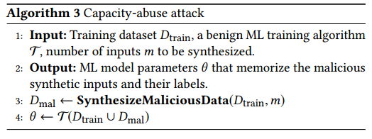

## 摘要
机器学习已经成为日用品。大量的机器学习框架和服务对于并非机器学习专家的数据持有者变得容易获取。当机器学习模型对于敏感输入（比如个人图片和文档）进行训练时，不要泄露太多信息是很重要的。

我们先考虑一个恶意地给用户提供机器学习训练代码的提供者，不观察训练，而是获取对结果模型黑盒或白盒的访问。在这个设定下，我们设计和实现了一些实际的算法，其中一些和标准的机器学习技术比如正则化和数据增强（data augmentation）很相似的，能够“记忆”训练集模型的信息，这个模型和传统的训练模型达到同样的精确度和可预测度。我们解释了我们的对手是如何能够从模型中撺取记忆信息的。

我们在通过在标准机器学习上进行图像分类（CIFAR10）、人脸识别（LFW and FaceScrub）和文本分析（20 Newsgroups and IMDB）的任务，对我们的模型进行评估。在所有的案例中，我们演示我们的算法如何创造这样一个具有高预测能力同时也允许对训练数据的精确萃取的模型。

## CCS概念
- 安全性和隐私 -> 软件和应用安全

## 关键词
隐私，机器学习

## 1 导语
机器学习（ML）成功地应用在许多数据分析任务中，从图像识别到零售购物预测。大量的ML库的服务在网上都很容易获得（见2.2），而且每年都有新的出现。

数据持有者想应用ML技术到它们的数据集上，这之中许多都包括敏感数据，而且很多使用者可能不是机器学习专家。他们把第三方的ML代码拿来用却不知道代码具体在做什么。只要结果模型的预测能力高，他们就不会问“这个模型对我的训练数据还获取了什么”。

现代机器学习模型，特别是人工神经网络，对记忆任何信息都有巨大的容量。这回导致过量供应：即使是一个精确模型都只需要用一小部分。ML库的提供者或者ML服务的操作可以修改训练算法是的模型能够解码出更多关于训练集的信息，同时还保证主要任务的高精度。

我们的贡献：我们演示了对训练算法较小的修改可以产生拥有和标准ML度量（比如精确性和泛化能力）下的高精度模型，这种模型可以泄露训练集的细节信息。

我们假设恶意的ML提供者供应给数据持有者训练算法，而数据持有者没有发现它的执行。在模型创建后，提供者获得了整个模型（白盒子）或者获得其输入输出端口（黑盒子）。提供者此时意图将训练集信息从模型中分离出来。在数据持有者使用恶意第三方ML库以及市面上的算法时会出现，这使得数据持有者向第三方支付数据环境安全的费用。

在白盒子案例中，我们评估了几个技术：1）将敏感信息编码到模型参数中最不重要的部分2）迫使参数与敏感信息高度相关；3）在参数符号中编码敏感信息。后两个技术包括添加恶意的“正则化”项目到损失函数中，而在数据持有者角度看上去像另一个正则化技术。

在黑盒子案例中，我们使用了一个类似数据增强（用额外生成的数据拓展数据集）的技术而且不对训练算法做任何修改。结果模型因此训练了两份任务。在一开始，是数据持有者指定的分类任务。恶意任务紧随其后：给一个特定的生成输入，“预测”一个或者更多实际训练集的秘密的信息。

因为与我们的合成增广输入相关的标签编码了有关训练数据的秘密，它们不符合这些输入中的任何结构。因此，我们的次要任务要求模型“学习”基本是随机标注的东西。然而，我们从经验上证明，模型过拟合了合成的输入，而且不影响它们对主要任务的准确性和泛化性。这使得黑盒子信息的以抽离，比如：对方提供了一个合成的输出，模型输出其标签，此时实际训练集的秘密信息在训练过程中被记忆。

我们在几个标准数据集上评估了黑白盒的恶意训练技术：CIFAR10（图像分类）Labeled Face和Wild（人脸识别），FaceScrub（性别分类和人脸识别）以及IMDB（二元情绪分类）。在所有的案例中，恶意训练模型表现出和传统训练模型相似的精度和泛化能力。

我们证明了敌手是如何将子集从训练模型中抽取出来的，以及参数的选择是如何影响抽取的数量和精度的。比如，白盒攻击直接从模型参数上解码出数据，我们建立了一个文本分类器，从10000文档的语料库中泄露了70%的训练数据，而且对模型精度没有任何负面影响。通过黑盒攻击，我们建立了一个二元性别分类器，可以精确地重建训练集中17个完整的脸部图像，即使这个模型每次查询只泄露了一个比特的信息。

对于黑盒攻击，我们评估了敌手攻击的成功如何依赖于对训练集的知识。对于在图像上训练的数据，敌手不需要辅助信息，可以直接使用随机图像作为合成增广输入。对于文本上的训练，我们比较了敌手知道训练文本的词汇表和敌手使用从公共语料库汇编的词汇表这两者的精度。

总的来说，使用第三方的代码来训练敏感数据的机器学习模型是危险的，即使代码提供者没有观察训练。我们证明了现代大记忆容量的ML模型是如何泄露数据的，即使在模型是以黑盒子发布而且模型精度和泛化能力没有影响的情况下。

## 2 背景
### 2.1 机器学习管道

我们关注的是在监督学习环境下的简单性，但是我们的技术也可以应用于非监督学习。机器学习模型是的函数fθ:X 7→Y,由字符串参数θ参数化。
我们有时会滥用符号,以及对fθ和θ互换使用。输入，或者说特征，空间是X，输出空间是Y，我们把重点放在分类问题上，X是一个d维向量空间Y是一个离散的类集合。

就我们的目的而言，机器学习管道由若干步骤组成，如图1所示。管道从一组标记数据点D = {(xi,yi)} =′1中(xi,yi)∈X×Y,1≤i≤n′。本集分为两个子集，训练数据Dtrain n和测试数据 Dtest。

#### 数据增强
提高ML模型的泛化能力（即对训练数据之外的输入的预测能力）的一种常见策略是在训练模型之前，将数据增强作为可选的预处理步骤。
训练数据Dtrain由确定性或随机转换生成的新数据点扩展。例如，一种图像增强算法可以对每个训练图像进行水平翻转或注入噪声和失真，随后的扩展数据集Daug 用于训练。许多库和机器学习平台提供了这个功能，包括Keras [36],MXNET [56], DeepDetect [19], and indico [34].

#### 训练和正则化
(可能是)数据集Daug作为输入(通常是随机的)训练算法T,也需要配置字符串作为输入,这个字符串γ被称为超参数（hyperparameters）。训练算法T输出一组参数θ,它定义了一个模型fθ:X→Y

为了找到对于f的最佳参数集合θ，训练算法T试图最小化损失函数L，损失函数惩罚真实标签y和fθ（x）产生的预测标签之间的不匹配。 经验风险最小化是这样做的一般框架，在Dtrain上使用以下目标函数：

其中Ω（θ）是一个正则化项，惩罚模型的复杂性，从而有助于防止模型过度拟合。

Ω的普遍选择是基于范数的正规化器，包括惩罚参数过大的l2-norm Ω（θ）=λÍiθi2，并且l1-norm Ω（θ）=λÍi|θi| 这增加了参数的稀疏性。 系数λ控制正则化术语对训练目标的影响程度。

有很多方法来优化上述目标函数。 随机梯度下降（SGD）及其变种常用于训练人工神经网络，但我们的方法也适用于其他数值优化方法。 SGD是一种迭代方法，在每一步中，优化器接收一小批训练数据，并根据目标函数的负梯度方向相对于θ更新模型参数θ。 当模型收敛到梯度接近零的局部最小值时，训练结束。

#### 验证
我们使用0-1损失来定义模型fθ相对于某个数据集D的精确度：

其中I是fθ（x）= y时输出1的函数，否则输出零。 

通过测量其测试精度acc（θ，Dtest）来验证经过训练的模型。 如果测试的准确性太低，验证可能会拒绝模型，输出一些我们用一个区分符号⊥表示的错误。 

一个相关的度量是训练测试的差距。它被定义为训练和测试数据集的精度差异

这个测试数据集是用来拟合模型数据集的模型。

#### 线性模型

支持向量机（SVM）[17]和逻辑回归（LR）是流行的分类任务方法，如文本分类[35]和其他自然语言处理问题[8]。

对于某个维度d，我们假设特征空间X = Rd。在Y = {-1,1}，θ∈X的二值分类支持向量机中，模型由fθ（x）= sign（θ⊤x）给出，其中函数符号返回输入是正还是负。
传统上，训练使用铰链损失（hinge loss），即L（y，fθ（x））= max {0,1-yθx}。支持向量机的典型正则化参数是L2范数。

对于LR，参数又由X中的向量组成，并定义模型f（x）=σ（θ⊤x）其中σ（x）=（1 + e-x）-1。在类别为{0，1}的二元分类中，输出在[0,1]中给出表示输入被分类为1的概率的值;如果fθ（x）≥0.5，则预测类别为1，否则为0。在训练期间使用的典型损失函数是交叉熵：L（y，fθ（x））= y·log（fθ（x））+（1-y）log（1-fθ（x））。正规化者是可选的并且通常根据经验选择。

线性模型对于训练通常是有效的，参数的数量在输入维数上是线性的。对于输入数百万维度的文本分类等任务来说，模型可能因此变得非常大。

#### 深度学习模型

深度学习在许多ML任务中已经非常流行，特别是与计算机视觉和图像识别相关的（例如，[41,46]）。非元素模型f是由输入映射到一系列中间状态的非线性变换层组成到输出。参数θ描述每个转换中使用的权重。随着网络深度的增加，参数的数量会变得很大。

损失函数和正规化者的选择通常取决于任务。在分类任务中，如果Y中有c个类别，则深度学习模型的最后一个层次通常是维度c的概率向量，代表输入属于每个类别的可能性。模型输出argmaxfθ（x）作为预测的类别标签。一个常见的分类损失函数是负的对数似然性：

其中，如果类别标签不是y = i和0，t是1。这里fθ（x）i表示c维向量fθ（x）的第i个分量。

### 2.2 机器学习平台和算法提供者

机器学习（ML）的普及已经导致ML库，框架和服务的数量激增。数据持有者可以使用内部基础架构和第三方ML库，或者越来越多地将模型创建外包给Google的预测API [27]，Amazon ML [3]，微软的Azure ML [54]等云服务。或者是一群初创公司[10,30,55,58]。
这些服务使大部分现代ML管道自动化。用户可以上传数据集，执行培训，并使得到的模型可供使用 - 所有这些都不了解模型创建的细节。

ML算法提供者（或简称ML提供者）是向数据持有者提供ML训练码的实体。许多云服务是ML提供商，但也有一些运营商提供训练算法的市场，客户支付第三方开发商上传的算法的费用。在市场场景中，ML提供者是算法开发者，而不是平台操作者。
 
Algorithmia[2]是一个ML市场的成熟例子。开发人员可以上传和列出任意程序（特别是ML培训程序）。用户可以支付开发者访问这样的程序，并让平台在用户的数据上执行。程序不一定是开源的，允许使用专有的算法。该平台可能会限制市场程序访问互联网，而且如果用户担心敏感数据泄漏Algorithmia明确警告用户应该只使用限制互联网的程序。
 
这些控制表明，现有的平台运营商已经把注意力集中在构建值得信赖的市场。软件隔离机制和网络控制有助于防止通过传统方式渗透训练数据。一些学术建议试图构建更高保证ML平台。例如，Zhai等人[74]提出了一个孤立环境的云服务，其中一个用户提供敏感数据，另一个提供秘密训练算法，云确保算法不能与外界通信，除了输出一个训练好的模型。明确的目标是向数据所有者保证ML提供者不能泄露敏感的训练数据。基于可信硬件如SGX [7,61,66]和基于安全多方计算的密码协议（参见第8节）的数据分析框架的进展也可以作为安全ML平台的基础。
 
即使ML平台是安全的（无论是在内部运行还是在云中运行），由ML提供者提供的算法也可能是不可信的。非专家用户可能不会审计开源实现或不了解代码在做什么。对于闭源和专有实施，审计可能不可行。此外，库可以被破坏，例如，通过妥协一个代码库[37,71]或一个VM镜像[6,14,73]。在本文中，我们调查在可信平台上使用不受信任的训练算法的潜在后果。

## 3 威胁模型

如第2.2小节所述，数据持有者经常使用其他人的训练算法从数据中创建模型。因此，我们关注数据持有者（客户端）将对手（ML提供商）提供的ML代码应用于客户数据的情况。
我们调查对手ML提供商 **是否可以泄露敏感的培训数据，即使他的代码运行在一个安全的平台上**？

#### 客户
客户端具有从特征空间X采样的数据集D，并且想要在D上训练分类模型fθ，如2.1小节所述。我们假设客户希望保持D私密性，就像D是专有文档，敏感的医学图像等那样。

客户将对手提供的机器学习管道（参见图1）应用到Dtrain，训练子集这个管道输出一个模型，由它的参数θ定义。客户端通过测量其在测试子集Dtest和测试列表间的准确性来验证模型，如果通过验证则接受该模型，然后通过释放θ或使API接口fθ可用于预测查询来发布它。我们将前者称为白盒访问，后者称为黑盒访问模型。

#### 对手
我们假设图1所示的ML管道是由对手控制的。一般来说，攻击者控制核心训练算法T，但在本文中，我们假设T是一个传统的良性算法，并且着重于对流水线的较小修改。例如，攻击者可以提供恶意数据增强算法A，或者恶意正规化器Ω，同时保持T完整。攻击者也可以在被T计算后修改参数θ。

对手控制的管道可以完全在客户端执行 - 例如，如果客户端在其数据上本地运行敌手的ML库。它也可以在第三方平台（如Algorithmia）上执行。我们假设使用软件[2,74]或硬件[61,66]隔离或加密技术来保护运行算法的环境。特别是对手不能直接与训练环境沟通，否则他可以简单地通过网络泄露数据。

#### 对手的目标

对手的主要目标是尽可能多地推断客户的私人训练数据集D.

一些现有的模型已经揭示了部分训练数据。
例如，最近的邻居分类器和支持向量机（SVMs）明确地将一些训练数据点存储在θ中。深度神经网络和经典的逻辑回归不知道泄漏任何特定的训练信息（参见第8节关于现有训练算法的隐私的更多讨论）。即使使用SVMs，攻击者也可能想要在默认设置下提供更多或不同的训练数据。对于攻击者无法直接访问θ的黑盒攻击，目前还没有一种方法通过SVM和最近邻模型来提取存储在θ中的敏感数据。

其他更有限的目标可以包括推断数据集D中已知输入的存在（这个问题被称为成员推理），关于D的部分信息（例如，D中的某个图像中存在特定的面部），或者与D的元素（例如，用于训练图像识别模型的数字照片中包含的地理位置数据）相关联的元数据。虽然我们在本文中没有探讨这些内容，但我们的技术可以直接用于实现这些目标。此外，他们需要的信息比重建整个训练输入所需的信息要少得多，因此我们预计我们的技术将更加有效。

#### 对训练环境的假设

对手的管道对训练数据Dtrain和正在训练的模型θ有无限制的访问。如上所述，我们关注对手不修改训练算法T而是
- （a）修改所得模型的参数θ，或
- （b）使用A用额外的训练数据来增加Dtrain，或
- （c）在T执行时应用他自己的调整器Ω。

我们假设对手既不能观察客户的数据，也不能观察对手的ML管道对这些数据的执行情况，也不能观察到最终的模型（直到客户发布）。我们假设合并到流水线​​中的对手代码是孤立的和受限制的，从而在对手执行时没有办法与对手进行通信或发信号。我们还假设，在模型被接受或拒绝之后，所有的训练环境状态都将被删除。因此，管道可以将关于数据集Dtrain的信息泄漏给对手的唯一方法是
- （1）迫使模型θ以某种方式“记住”这个信息，以及
- （2）确保θ通过验证。

#### 访问模型

通过白盒访问，攻击者直接接收模型。
他可以直接检查θ中的所有参数，但不能在训练中使用任何临时信息。例如，如果客户发布θ，则出现这种情况。

对于黑箱访问，攻击者有输入输出访问θ：给定任何输入x，他可以得到模型的输出fθ（x）。例如，该模型可以部署在一个应用程序内，对手将该应用程序用作客户。因此，我们把重点放在最简单（对于对手最难的情况），即他只学习模型给他的输入的类标签，而不是包含每个可能类别概率的整个预测向量。

## 4 白盒攻击

在白盒攻击中，攻击者可以看到训练模型的参数。 因此，我们关注于直接对参数中的训练数据集的信息进行编码。 主要的挑战是如何让客户接受最终的模型。 特别是当模型应用于测试数据集时，模型必须对客户的分类任务有很高的准确性。

### 4.1 LSB 编码

许多研究表明，在机器学习模型中不需要高精度参数来实现高性能[29,48,64]。 这一观察激发了一种非常直接的技术：简单地将有关训练数据集的信息编码为模型参数的最低位（低位）。

#### 编码
算法1描述了编码方法。 首先，使用常规训练算法T训练良性模型，然后通过将每个参数的低b位设置为从训练数据中提取的比特串s，对模型参数θ进行后处理，产生修改后的参数θ'。 
#### 萃取
秘密字符串可以是来自Dtrain的压缩原始数据，也可以是关于对手想要捕获的Dtrain的任何信息。 s的长度限制为lb，其中l是模型中参数的数量。

#### 解码

简单地读取参数 θ ′ 中较低的位并将其翻译为秘密位。

### 4.2 相关值编码
另一种方法是在训练模型参数的同时逐渐编码信息。 攻击者可以将损失函数L（见第2.1节）的恶意项添加到参数和他想要编码的秘密之间的相关性最大化。

在我们的实验中，我们使用Pearson相关系数的负绝对值作为损失函数的额外项。 在训练期间，它将梯度方向驱动到局部最小值，其中秘密和参数高度相关。 算法2给出了在损失函数中带有恶意正则项的SGD训练算法的模板。

#### 编码

首先从训练数据中提取秘密值s∈Rl的向量，其中l是参数的数量。 然后，在损失函数中添加一个恶意相关项C。

在上面的表达式中，λc控制相关性水平，θ_，s_分别是θ和s的平均值。 C越大，θ和s越相关。在优化过程中，C相对于θ的梯度用于参数更新。

观察到这个C类似于机器学习框架中常用的常规调节器（参见2.1节）。与之前讨论的基于规范的正则器的区别在于，我们给C中的每个参数分配一个权重，这取决于我们想要模型记住的秘密。这个式子将参数歪曲到与这些秘密相关的空间。恶意正则器找到的参数不一定与常规正则化参数相同，但是恶意正则器具有将参数空间限制在较不复杂子空间的相同效果[72]。

#### 萃取
从训练数据Dtrain中提取敏感数据的方法取决于数据的性质。如果原始数据中的特征都是数字的，那么原始数据可以直接用作秘密。例如，我们的方法可以迫使参数与训练图像的像素强度相关联。

对于诸如文本的非数值数据，我们使用数据相关的数值进行编码。我们将词汇表中的每个唯一标记映射到低维伪随机向量，并将模型参数与这些向量相关联。伪随机性确保敌手在令牌和向量之间具有固定的映射，并且可以唯一地恢复给定向量的令牌。
#### 解码
如果敏感数据中的所有特征都是数字的并且在相同范围内（对于原始像素强度值在[0,255]范围内），攻击者可以容易地将参数映射回特征空间，因为相关参数是近似线性变换的的编码特征值。

为了解码文本文档，其中令牌被转换成伪随机向量，我们执行对相应向量与参数最相关的令牌的蛮力搜索。更复杂的方法（例如纠错码）应该更好，但我们在本文中没有对其进行探索。

在第6节中，我们提供了关于这些特定数据集解码过程的更多细节。

### 4.3 符号编码

在模型参数中编码信息的另一种方式是将它们的符号解释为比特串，例如，正参数代表1，负参数代表0。
机器学习算法通常不对符号施加约束，但是对手可以修改强制大部分符号与他想要编码的秘密位串匹配。
#### 编码
从训练数据中提取秘密二进制向量s∈{-1,1}^ l，其中l是θ中的参数个数，并且约束θi的符号以匹配si。这种编码方法相当于解决以下约束优化问题：

由于其复杂性，解决这个约束优化问题对于像深度神经网络这样的模型来说可能是棘手的。相反，我们可以使用惩罚函数法将其放松到一个无约束优化问题[60]。这个想法是将约束条件转化为一个惩罚项加到目标函数中，如果不满足约束条件，则惩罚项目。在我们的例子中，我们定义惩罚项P如下：

在上面的表达式中，λs是控制惩罚幅度的超参数。当θi和si具有相同的符号|θisi|时，加上零惩罚否则是罚款。

攻击算法与算法2大致相同，两行更改。第5行变成s←ExtractSecretSigns（D，l），其中s是长度为l的二进制向量，而不是实数向量。在第9行中，P替换了相关项C.类似于相关项，P改变梯度的方向以驱动参数朝​​向在满足所有符号约束的R1中的子空间。
实际上，解决方案可能不会收敛到满足所有约束的点，但是如果λs足够大，我们的算法可以使大部分编码正确。

注意到P与L1范数正则化非常相似。当参数的所有符号不匹配时，术语P恰好是l1范数，因为-θisi总是正的。由于在实践中所有参数都不太可能在所有参数上都有“不正确的”符号，而它们需要对它们进行编码，所以我们的恶意项对目标函数的惩罚小于L1-准则。

#### 萃取
可以提取的位数受限于参数的数量。不能保证在优化过程中秘密比特可以被完美编码，因此这种方法不适合对训练数据的压缩二进制数进行编码。相反，它可以用来编码原始数据的位表示。例如，来自图像的像素可被编码为8位整数，精度损失较小。

#### 解码
从模型中恢复秘密数据需要简单地读取模型参数的符号，然后将它们解释为秘密的位。

## 5 黑盒攻击

黑盒攻击更具挑战性，因为攻击者无法看到模型参数，只能访问预测API。 我们专注于（更难）的设置，其中响应于对抗选择的特征矢量x，API应用fθ（x）并输出相应的分类标签（但不是相关的置信度值）。 上一节中的攻击都不会在黑盒子的设定中有用。

### 5.1 滥用模型容量

我们利用现代机器学习模型有大量记忆任意标记的数据的事实[75]。我们使用合成输入来“扩充”训练数据集，这些输入的标签编码我们希望模型泄漏的信息（在我们的例子中是关于原始训练数据集的信息）。当模型在增强数据集上进行训练时，即使使用传统的训练算法，模型也会变得过于合适。当敌手向训练模型提交这些合成输入之一时，模型在训练期间输出与该输入相关联的标签，从而泄漏信息。

算法3概述了攻击。首先，合成恶意数据集Dmal，其标签编码Dtrain的秘密。然后训练Dtrain和Dmal联合的模型。

注意到整个训练方式与良性训练完全一样。对手修改的唯一组件是生成额外的训练数据，即增强算法A.数据增强是提高机器学习模型性能的一个非常普遍的做法[41,69]。

### 5.2 合成恶意增强数据

理想情况下，每个合成数据点可以对信息进行编码，其中c是模型输出空间中的类数。算法4概述了我们的综合方法。类似于白盒攻击，我们首先从Dtrain中提取一个秘密位串s。然后我们确定性地合成一个长度为⌊log2（c）each的子串的一个数据点。不同类型的数据需要不同的合成方法。

#### 合成图像

我们假设没有合成图像的辅助知识。对手可以使用任何合适的生成数据(GenData)方法：例如，使用对手选择的伪随机函数（PRF）（例如HMAC [39]）来生成伪随机图像，或者创建稀疏图像，其中只有一个像素被填充（类似地生成）伪随机值。

我们发现后一种技术在实践中非常有效。 GenData枚举图像中的所有像素，并为每个像素创建一个合成图像，其中相应的像素设置为伪随机值，而其他像素设置为零。每个合成图像中的多个像素可以使用相同的技术。

#### 合成文本
我们考虑合成文本文档的两种情况。

如果敌手知道训练数据集的确切词汇，他可以使用这个词汇作为GenData的辅助知识。 GenData的一个简单的确定性实现枚举辅助词汇表中的令牌。例如，GenData可以按字典顺序枚举所有单例标记，然后按照字典顺序枚举所有的标记对，依此类推，直到列表与所需的合成文档数量一样长。然后将每个列表条目设置为扩展训练数据集中的文本。

如果敌手不知道确切的词汇，他可以从一些公共语料库中收集经常使用的词作为生成合成文档的辅助词汇。在这种情况下，伪随机地确定性地执行GenData（对手已知的种子）从词汇表中抽样单词，直到生成所需数量的文档。

为了在这种情况下生成文档，我们简单的合成算法从公共词汇中抽取一定数量的单词（在我们的实验中为50），并将它们作为单个文档加入。单词的顺序并不重要，因为特征提取步骤只关心给定单词是否出现在文档中。

这种合成算法可能会偶尔生成只包含模型实际词汇表中不会出现的单词的文档。这些词在特征提取阶段通常会被忽略，因此生成的文档将具有空白的特征。如果攻击者不知道模型的词汇，他不知道一个特定的合成文档是否只包含词汇中的词汇。这可能会降低模型的测试精度和解码精度。

在6.7节中，我们用公开的词汇来实验性地衡量了容灾攻击的准确性。

#### 解码记忆的信息

由于我们的增强数据的综合方法是确定性的，对手可以复制合成过程，并使用与训练期间使用的相同的合成输入查询训练的模型。如果模型对这些输入过度配置，那么由模型返回的标签将与训练期间与这些输入相关联的标签完全相同，即编码的秘密位。

如果一个模型具有足够的容量来实现原始训练数据的良好精度和泛化能力，并记忆恶意训练数据，那么acc（θ，Dmal）将接近完美，从而在提取敏感数据时导致低误差。

### 5.3 为什么滥用容量有效？

深度学习模型具有如此巨大的记忆能力，可以基本上表达任何适合数据的功能[75]。在我们的例子中，模型不仅适用于原始训练数据集，而且也适用于（本质上）随机标记的合成数据。如果原始数据的测试精度较高，则该模型被接受。如果合成数据的训练精度很高，攻击者可以从分配给这些输入的标签中提取信息。

重要的是，这两个目标并不冲突。对恶意增强的数据集进行训练，从而产生在其原始训练输入上具有高质量的模型，但泄露了增强输入上的信息。

在SVM和LR模型的情况下，我们关注高维和稀疏数据（自然语言文本）。我们的综合方法也产生非常稀疏的输入。根据经验，合成输入位于超平面（分类器）的错误一侧的可能性在这个高维空间中变得非常小。

## 6 实验

我们在基准图像和文本数据集上评估我们的攻击方法，分别使用灰度训练图像和有序令牌作为记忆在模型中的秘密。 

对于每个数据集和任务，我们首先使用传统的训练算法训练良性模型。 然后，我们训练和评估每种攻击方法的恶意模型。 我们假设恶意训练算法有一个硬编码的秘密，可以用作伪随机函数或加密的关键。 

所有ML模型和攻击都是在Python 2.7中用Theano [70]和Lasagne [20]实现的。 这个实验是在一台机器上进行的，这个机器有两个8核英特尔i7-5960X处理器，64GB内存和三个Nvidia TITAN X（Pascal）GPU，每个处理器有12GB的VRAM。

表1：
数据集和模型的总结。 n是训练数据集的大小，d是输入维数。 RES代表残余网络，卷积神经网络的CNN。 对于FaceScrub，我们使用性别分类任务（G）和人脸识别任务（F）。

### 6.1 数据和任务

表1总结了我们在实验中使用的数据集，模型和分类任务。
我们使用敏感数据的几个代表性的公开可用的图像和文本数据集作为替代品。 
**CIFAR10** 是一个对象分类数据集，包含50,000个训练图像（10个类别，每个类别5,000个图像）和10,000个测试图像[40]。每个图像具有32×32像素，每个像素具有对应于RGB强度的3个值。

**户外脸部标记**（Labeled Faces in the Wild，LFW）包含13,233张5,749个人的图像[33,45]。我们使用75％训练，25％测试。对于性别分类任务，我们使用额外的属性标签[42]。每个图像都从原始尺寸重新调整为67x42像素，以便所有图像具有相同的尺寸。

**FaceScrub** 是100K图像的URL数据集[59]。任务是面部识别和性别分类。某些网址已过期，但我们可以为530个个人下载76,541张图片。我们使用75％的培训，25％的测试。每个图像都从原始尺寸重新缩放到50x50 RGB像素。 

**20Newsgroups**是一个包含20个类别的20,000个文档的集合[44]。我们使用75％的培训，25％的测试。 

**IMDB电影评论**是一个标有正面或负面情绪的50,000个评论的数据集[52]。任务是（二元）情绪分析。我们使用50％的培训，50％的测试。

### 6.2 ML模型

#### 卷积神经网络

卷积神经网络（CNN）[47]由一系列卷积运算组成，可以提取空间不变特征。这些卷积操作中的滤波器是要学习的参数。我们在LFW数据集上使用5层CNN进行性别分类。前三层是卷积层（第一层有32个过滤器，第二层有64个过滤器，第三层有128个过滤器），然后进行最大化处理，将卷积特征的大小减半。卷积层中的每个滤波器都是3x3。卷积输出连接到256个单元的完全连接层。后一层连接到预测性别的输出层。

对于超参数，我们设定最小批量为128，学习率为0.1，并使用Nester和Momentum的SGD来优化损失函数。我们还使用l2范数作为λ为10-5的正则化器。我们将训练的时期数量设置为100.在时代40和60中，为了更好的收敛，我们将学习速率降低0.1倍。这个配置继承了Lasagne.1剩余网络中的剩余网络实现。

#### 残留网络
当通过添加从低层到高层的身份映射来优化非常深的CNN时，残留网络（RES）[31]克服了梯度消失问题。这些网络在2016年获得了许多基准视觉数据集的最新性能。

我们为CIFAR10和FaceScrub使用了34层残留网络。虽然网络的参数比CNN少，但是深度更深，可以更好地表达输入数据。超参数和CNN一样。

#### 词袋线性模型
对于文本数据集，我们使用一个流行的管道，使用Bag-of-Words（BOW）提取特征并训练线性模型。 

BOW将每个文本文档映射到R|V|中的一个向量其中V是出现在语料库中的词汇的词汇。每个维度表示文档中该令牌的计数。向量是非常稀疏的，因为在任何给定的文档中只有V的几个令牌出现。

然后，我们将BOW向量馈入SVM或LR模型。对于20Newsgroups数据，有20个类别，我们应用One-vs-All方法来训练20个二进制分类器来预测一个数据点是否属于相应的类别。我们使用AdaGrad [23]（一种SGD的变体）对线性模型进行训练，自适应地调整每个参数的学习率。我们将最小批量设置为128，学习率为0.1，对AdaGrad进行训练的时间数为50，这些线性模型收敛速度非常快。

### 6.3 评估指标

因为我们的目标是在保证质量的同时对模型中的秘密进行编码，所以我们测量攻击者的解码准确度和模型对测试数据的分类准确性（对训练数据的准确度在所有情况下都超过98％）。
我们的攻击在训练中引入了较小的随机性，因此恶意训练模型的准确性有时会超过传统训练模型的准确性。

#### 用于解码图像的指标
对于图像，我们使用平均绝对像素误差（MAPE）。给定一个解码图像x'和原始图像x有k个像素，MAPE是k 1Íki = 1 | xi - xi'|。其范围是[0,255]，其中0表示两个图像是相同的，255表示每对相应的像素具有最大不匹配。

#### 解码文本的指标
对于文本，我们使用精度（解码文档中出现在原始文档中的令牌的百分比）和召回（解码文档中出现的来自原始文档的令牌的百分比）。为了评估解码文档和原始文档之间的相似度，我们还根据训练词汇的BOW模型构造的特征向量来测量它们的余弦相似度。

### 6.4 LSB编码攻击

表2总结了LSB编码攻击的结果。
#### 编码
对于每个任务，我们压缩训练数据的一个子集，在CBC模式下用AES加密，并将密文比特写入良性训练模型参数的低位。表2中的第四列显示了在测试精度显着下降之前我们可以使用的位数。

#### 解码
解码总是完美的，因为我们使用无损压缩，并且在编码期间不引入错误。对于20个新闻组模型，攻击者可以成功提取约57 Mb的压缩数据，相当于训练数据集的70％。

#### 测试精度

在我们的实现中，每个模型参数都是一个32位的浮点数。根据经验，对于大多数数据集，b低于20并不会降低测试的准确性。图像二进制分类（LFW，FaceScrub Gender）可以承受更多的精度损失。对于多类任务，当b超过20时，测试精度显着下降，如图2中的CIFAR10所示。

### 6.5 相关值编码攻击

表3总结了这次攻击的结果。

#### 图像编码和解码

我们将模型参数与灰度训练图像的像素强度相关联。参数的数量限制了可以用这种方式编码的图像数量：CIFAR10为455，FaceScrub为200，LFW为300。

我们通过将相关参数映射回像素空间来解码图像（如果相关性是完美的，则参数是简单线性变换的图像）。为了给出一系列参数，我们使用最小-最大比例将最小参数映射到0，最大到255，并将其他参数映射到相应的像素值。如果相关性为正，则获得转换后的近似原始图像，如果相关性为负，则获得近似倒置的原始图像。

在转换之后，我们测量不同的λc选择的平均绝对像素误差（MAPE），其控制相关性水平。我们发现为了恢复合理的图像，所有任务的λc需要超过1.0。对于一个固定的λc，二元分类的误差比多类任务的误差要小。图3显示了FaceScrub数据集的重构图像的例子。

#### 文本编码和解码

为了进行编码，我们为训练语料库的词汇表中的每个标记生成32位浮点数的伪随机，d'维向量。然后，给定一个训练文档，我们使用该文档中前100个令牌的伪随机向量作为与模型参数相关的秘密。我们将d'设置为20.编码一个文档因此需要多达2000个参数，使我们能够为20个新闻组编码大约1300个文档，为IMDB编码150个。

为了解码，我们首先复制在训练期间使用的每个令牌的伪随机向量。对于应该与令牌匹配的参数的每个连续部分，我们通过搜索相应向量与参数最佳相关的令牌来解码。我们设置一个阈值τ，如果相关值大于τ，我们接受这个令牌，否则拒绝。

表3显示了不同τ的解码结果。正如预期的那样，较大的τ提高了精度并减少了召回经验上，τ= 0.85产生高质量的解码文件（见表5中的例子）。

#### 测试准确性

具有较低解码错误的模型也具有较低的测试精度。对于二元分类任务，我们可以保持MAPE合理低，同时将测试精度降低0.1％。对于CIFAR10和FaceScrub人脸识别，较低的MAPE需要较大的λc，这又将测试精度降低了1％以上。对于20个新闻组，测试精度仅下降0.16％。对于IMDB，下降更为显着：SVM为0.66％，LR为1.15％。

### 6.6 符号编码攻击

表4总结了符号编码攻击的结果。

#### 图像编码和解码

如4.3节所述，符号编码攻击可能无法正确编码所有位。因此，我们使用灰度训练图像的原始像素的比特表示作为待编码的字符串，而不是用于LSB编码的加密的压缩二进制文件。每个像素是一个8位无符号整数。编码能力因此是相关值编码攻击的18。我们可以为CIFAR10编码56个图像，为FaceScrub编码25个图像，为LFW编码37个图像。

为了重构像素，我们组装参数符号中表示的位。对于λs= 50，所有数据集的MAPE都很小。对于FaceScrub上的性别分类，误差可以小于1，即重构几乎是完美的。

#### 文本编码和解码

我们使用词汇表中的索引为每个标记构建一个比特表示。每个令牌的位数是⌈log2（| V |）⌉，对于20个新闻组和IMDB都是17。我们对每个文档中的前100个字进行编码，因此每个文档总共需要1700个参数符号。我们用这种方法为20个新闻组编码1530个文件，为IMDB编码180个文件。

为了重构令牌，我们使用17个连续参数的符号作为词汇的索引。设定λs≥5对大多数任务来说都会产生好的结果（参见表5中的例子）。解码不如相关值编码攻击准确。原因是标志需要几乎完美的编码来恢复高质量的文档;即使17位中的1位错误，我们的解码也会产生一个完全不同的标记。更复杂的纠错解码技术可以在这里应用，但是我们将这个问题留给未来的工作。

#### 测试准确性

这种攻击不会显着影响图像数据集上二进制分类模型的测试准确性。对于LFW和CIFAR10，测试精度偶尔会增加。对于多类任务，λs较大时，FaceScrub人脸识别率降低2.6％，而λs= 50的CIFAR10模型仍然具有较好的泛化能力。

对于20个新闻组，对于所有的λs值，测试精度变化小于0.5％。对于IMDB，SVM和LR的准确性降低了0.8％左右，降至1.2％。

### 6.7 容量滥用攻击

表6总结了结果。

#### 图像编码和解码

我们可以使用与符号编码攻击相同的技术，但对于二进制分类器，每个像素需要8个合成输入。相反，我们用4位编码一个近似的像素值。我们映射一个像素值p∈{0，... ，255}到p'∈{0，...，15}（例如，p中的映射0-15到p'中的0）并使用4个合成数据点来编码p'。另一种可能性（在本文中未被评估）将是对每一个其他像素进行编码，并通过插入缺失的像素来恢复图像。

我们评估m，合成数据点的数量的两个设置。对于LFW，我们可以编码m = 34K的3个图像和m = 58K的5个图像。对于FaceScrub性别分类，我们可以编码m = 110K的11个图像和m = 170K的17个图像。虽然这些数字可能看起来很低，但是这种攻击是针对二进制分类器的黑盒子设置的，对手的目标是从一个输出位恢复信息。而且，对于许多任务（例如，医学图像分析），即使单个训练输入也恢复，构成严重的隐私违约。最后，如果攻击者的目标不是恢复原始图像，而是恢复关于训练数据集的一些其他信息（例如，图像的元数据或某些面部的存在），则该容量可能就足够了。

对于CIFAR10和FaceScrub人脸识别等多类任务，我们可以对每个合成数据点编码多个信息位。对于CIFAR10，有10类，我们使用两个合成输入来编码4位。对于FaceScrub，理论上一个合成输入可以编码超过8位的信息，因为有超过500个类，但是我们每个输入只编码4位。我们发现编码更多的比特可以防止收敛，因为合成输入的标签变得太细。我们评估m的两个设置。对于CIFAR10，我们可以对m = 49K的50个图像和m = 98K的50个图像进行编码。对于FaceScrub人脸识别，我们可以编码22个m = 55K的图像和44个m = 110K的图像。

为了解码图像，我们重新生成合成输入，使用它们来查询训练的模型，并将模型返回的输出标签映射回像素。我们测量原始图像和解码的近似4位像素图像之间的MAPE。对于大多数任务来说，误差很小，因为该模型非常适合合成输入。虽然近似像素精度较低，但重建图像仍然可以识别——请参见图3的第四行。

#### 文本编码和解码

我们使用与符号编码攻击相同的技术：一个位串按照它们在训练文档中出现的顺序对令牌进行编码，每个令牌有17位。每个文档因此需要1,700个合成输入来编码其前100个令牌。 
20个新闻组模型有20个类，我们使用前16个来编码4位信息。二进制IMDB模型只能对每个合成输入进行一位编码。我们评估m的两个设置。对于20个新闻组，我们可以对m = 11K的26个文档和m = 33K的79个文档进行编码。对于IMDB，我们可以对m = 24K的14个文档和m = 75K的44个文档进行编码。

通过这种攻击，解码后的文件质量很高（见表5）。在这些结果中，攻击者利用所使用词汇的知识（见下面的其他案例）。对于20个新闻组，恢复对于SVM和LR来说都是完美的。对于IMDB，恢复的文档是好的，但是质量会随着合成inp测试精度的增加而降低。

#### 测试精度

对于图像数据集，二进制分类器测试精度的下降在0.5％以内。对于LFW，测试精度甚至略有增加。对于CIFAR10，当我们将m设置为原始数据集的两倍时，降低变得显着。精度对FaceScrub中的人脸识别最为敏感，因为类的数量太大。对于文本数据集，m是原始数据集的三倍，导致20个新闻组的测试精度下降不到0.6％。在IMDB上，当合成输入的数量与原始数据集大致相同时，测试精度下降小于0.6％。

#### 使用公共辅助词汇

用于容量滥用的合成图像是伪随机生成的，并且不需要攻击者对实际训练数据集中的图像具有任何先验知识。但是，对于文本攻击，我们假定攻击者知道训练数据中使用的确切词汇，即所有训练文档所用的单词列表（见第5.2节）。

我们现在放松这个假设，并假设攻击者使用从公开可用的语料库收集的辅助词汇：Brown Corpus，2 Gutenberg Corpus [43]，3 Rotten Tomatoes [62]，4以及Tesseract OCR5的单词列表。

显然，这公共辅助词汇不需要事先知道模型的实际词汇。它包含67K令牌，需要18位来编码每个令牌。我们将目标设置为每个文档中出现的前100个令牌，并丢弃不在公共词汇表中的令牌。我们的文档综合算法从这个公共词汇中取样50个词，并将它们传递给用训练词汇构建的词袋模型以提取特征。在解码期间，我们使用合成输入来查询模型并获得预测位。我们使用每个连续的18位作为公共词汇的索引来重建目标文本。

表7显示了这个公共词汇的攻击结果。对于20个新闻组，解码可以为SVM和LR模型生成高质量的文本。随着合成文件数量的增加，SVM模型的测试精度略有下降。对于IMDB，我们观察到SVM和LR模型的测试精度下降幅度较小，并且当合成文档的数量大致等于原始训练文档的数量时，仍然可以合理地重建训练文档。

#### 记忆容量和模型大小

为了进一步研究模型参数的数量和恶意记忆训练数据集的“额外”信息的能力之间的关系，我们在最后的卷积层中比较了CNN和不同数量的滤波器：16,32,48,...我们使用这些网络来训练一个设置为11K的LFW的模型，并且测量其测试精度（即其主要任务的准确度）及其对合成输入的解码准确度（即，恶意任务的准确度）。

图4显示了结果。对于越来越小的模型，测试精度是相似的。然而，较小模型的编码能力，即它们在合成数据上的测试精度要低得多，因此导致不太精确的解码。这表明，正如所料，更大的模型有更多的记忆任意数据的能力。

#### 容量滥用的可视化

图5将CIFAR10模型的特征可视化，该CIFAR10模型已经通过恶意生成的合成图像对其原始训练图像进行了训练。从训练数据和综合数据的剩余网络的最后一层输出中采样点，然后使用t-SNE投影到2D [53]。该图清楚地表明，所学习的特征在训练数据的类别和合成数据的类别之间几乎是线性可分的。训练数据的类别对应于主要任务，即图像中不同类型的对象。合成数据的类对应于恶意任务，即给定特定的合成图像，该类对关于训练图像的秘密进行编码。这表明该模型已经很好地学习了其主要任务和恶意任务。

## 7 对策

检测训练算法是否试图在模型中记忆敏感数据不是直截了当的，因为正如我们在本文中所展示的那样，有许多技术和场所可以对这些信息进行编码：直接在模型参数中，通过应用恶意的正规化器通过使用特制的输入来增加训练数据。手动检查代码可能无法检测到恶意的意图，因为这些方法中的许多方法与标准ML技术相似。

减轻LSB攻击的一个有趣的方法是将其与自己对抗。攻击依赖于模型参数的低位对模型精度基本上不重要的观察。因此，客户端可以用随机噪声代替参数的低位。这将破坏这些位中可能编码的任何信息，而不会影响模型的性能。

恶意训练的模型可能会显示异常的参数分布。图6比较了具有零均值高斯形状的常规训练模型中的参数分布到恶意训练的模型。如预期的那样，由相关值编码攻击产生的参数分布非常不同。由符号编码攻击产生的参数更集中于零，这类似于常规l1范数正则化的效果（其鼓励参数的稀疏性）。为了检测这些异常情况，数据拥有者必须事先了解“正常”参数分布是什么样的。这表明部署这种异常检测可能是具有挑战性的。

容量滥用攻击产生的参数没有明显不同。这是预料之中的，因为训练与以前完全一样，只有数据集增加了额外的输入。

## 8 相关工作

#### ML中的隐私威胁
以前的工作没有考虑恶意学习算法，目的是创建泄漏关于训练数据集的信息的模型。

Ateniese等人[4]显示攻击者如何使用对ML模型的访问来推断训练数据的谓词，例如，语音识别系统是否仅由印度英语使用者训练。

Fredrikson等人[26]探索模型反演：给定一个模型fθ，给出一个隐藏的特征向量x1，...，xn。 。 。 ，xn，他们使用了地面真实性和x1，...的一个子集。

xn推断剩余的未知特征。模型反演以相同的方式运行，无论特征向量x1,...,xn是否在训练数据集中，但由于过拟合而在经验上更好地训练设定点。随后的模型反演攻击[25]表明，如果访问一个人脸识别模型，如何构造某个输出类的代表（当每个类对应一个人时是一个可识别的面）。

与上述技术相比，我们的目标是提取属于用来创建模型的训练数据集的特定输入。

荷马等人[32]根据发表的关于全基因组关联研究的统计数据，开发了一种技术来确定研究中是否使用了特定的已知基因组。这被称为会员推理问题。随后的工作扩展了这项工作，发表了噪声统计学[24]和基于微RNA的研究[5]。

Shokri等人研究了监督ML模型的成员推理攻击。 [68]。他们使用黑箱访问模型fθ来确定给定的标记特征向量（x，y）是否是用于产生θ的训练集的成员。当fθ具有低泛化能力时，即如果训练输入的准确度比来自训练数据集外部的输入要好得多，则它们的攻击效果最好。

相比之下，我们研究如何恶意训练算法可以有意地创建一个模型泄漏关于其训练数据集的信息。会员推断和我们的问题之间的区别类似于旁道和隐道之间的区别。我们的威胁模型对对手来说更为慷慨，因此我们的攻击比以前的任何工作都能提取更多关于训练数据的信息。另一个重要的区别是我们的目标是创建一个通用性良好但泄漏信息的模型。

#### 逃避和中毒

逃避攻击旨在制造将被ML模型错误分类的输入。他们首先在垃圾邮件检测方面进行了探索[28,50,51]。
最近的一项研究调查了计算机视觉等其他领域的规避行为 - 参见Papernot等人的一项调查。 [63]。我们的工作侧重于培训数据的保密性而不是逃避，但未来的工作可能会调查恶意的ML提供商如何故意创建便于逃避的模型。

中毒攻击[9,18,38,57,65]将恶意数据点插入训练数据集中，使得最终的模型更容易逃避。这种技术在精神上类似于我们容量滥用攻击中的恶意数据增强（第5节）。然而，我们的目标并不是逃避，而是迫使模型泄露训练数据。

#### 保护ML环境

从[49]开始，已经有很多关于使用安全的多方计算来使得多方能够在他们的单独数据集上创建联合模型的研究，例如， [11，16，22]。在[67]中提出了一个分布式的，保密的深度学习协议。

阿巴迪等人[1]描述如何训练差异化的私人深度学习模式。使用可信硬件的系统（如SGX）在不受信任的服务培训的同时保护培训数据[21,61,66]。在所有这些工作中，训练算法是公开的并且是一致的，只有当用户被欺骗使用恶意算法时，我们的攻击才能工作。 CQSTR [74]明确地针对训练算法可能不完全可信的情况。我们的研究结果表明，在这种情况下，即使输出被限制为一个准确和可用的模型，恶意训练算法也可能隐藏大量的数据。隐私保护分类协议试图防止用户的输入特征泄露给模型所有者以及向用户公开模型[12]。使用这样的系统可以防止我们的白盒攻击，而不是黑盒攻击。 

#### ML模型容量和压缩

我们的容量滥用攻击利用了许多模型（特别是深度神经网络）具有巨大记忆能力的事实。张等人[75]表明，现代ML模型可以达到（接近）100％的训练准确性的数据集随机标签，甚至随机特征。他们认为，这破坏了以前对基于训练准确性的泛化界限的解释。我们的容量滥用攻击利用（基本上）随机数据来增加训练数据。

## 9 结论

我们证明了恶意机器学习（ML）算法可以创建满足准确性和一般性的标准质量度量标准的模型，同时泄漏大量关于训练数据集的信息，即使对手只有黑箱访问模型。

ML不能盲目地应用于敏感数据，特别是如果模型训练码是由另一方提供的话。如果数据持有者打算直接或间接地将结果模型提供给其他用户，他们不能无视ML系统的内部运作。无论何时他们使用别人的ML系统或将ML作为服务（即使服务承诺不遵守其算法的操作），他们都应该要求查看代码并理解它在做什么。

一般来说，我们需要机器学习的“最小特权原则”。 ML训练框架应该确保该模型只捕获训练数据集，而不像其指定的任务所需要的那样。如何形式化这一原则，如何开发实用的培训方法，以及如何对这些方法进行认证，这些都是未来研究的热点话题。

资助确认。这项研究得到了NSF拨款1611770和1704527以及来自Google，Microsoft和Schmidt Sciences的研究奖项的部分支持